# 모니터링 스택 구축 작업 완료 내역

> 작성일: 2026-02-20
> Branch: feat/add-monitoring

---

## 📋 전체 개요

Grafana LGTM Stack (Loki + Grafana + Tempo + Mimir/Prometheus) 기반 모니터링 시스템 구축 완료.

**핵심 아키텍처:**

- Prometheus: 메트릭 수집 및 저장 (15일 보관)
- Loki: 로그 수집 및 저장 (31일 보관)
- Tempo: 분산 트레이스 수집 및 저장 (7일 보관)
- Grafana: 통합 시각화 및 쿼리 인터페이스
- Grafana Alloy: 통합 에이전트 (로그/트레이스 수집 및 전달)
- Node Exporter: 시스템 메트릭 수집
- cAdvisor: 컨테이너 메트릭 수집
- Alertmanager: 알림 관리 (Slack 알림 보류)

### 전체 아키텍처 다이어그램

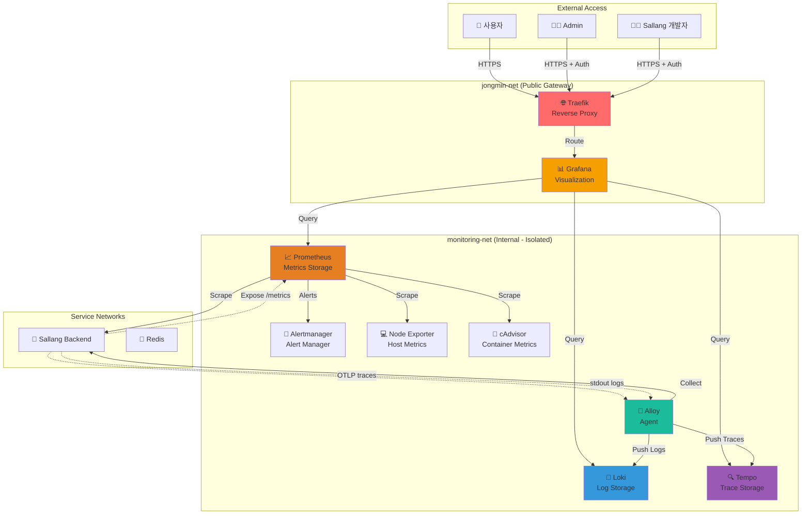

---

## 🏗️ 네트워크 아키텍처

### 네트워크 격리 구조

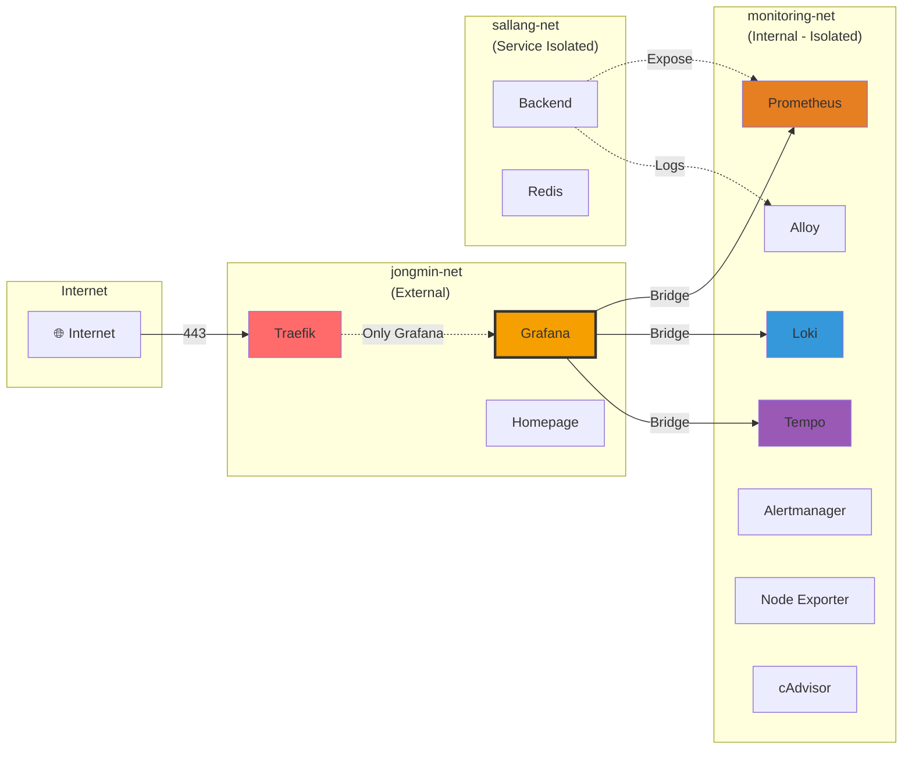

**핵심:**

- `monitoring-net`: **internal=true** (외부 차단)
- Grafana만 양쪽 네트워크에 연결 (Gateway 역할)
- 서비스는 자체 격리 네트워크 사용

---

## 📊 데이터 흐름

### 메트릭 수집 (Prometheus)

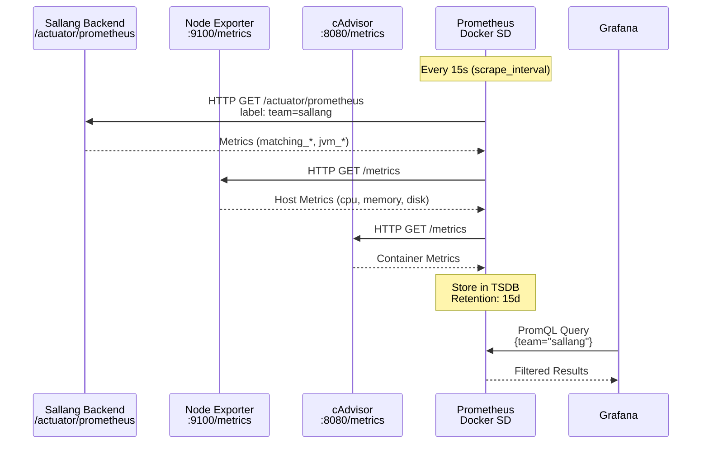

### 로그 수집 (Loki)

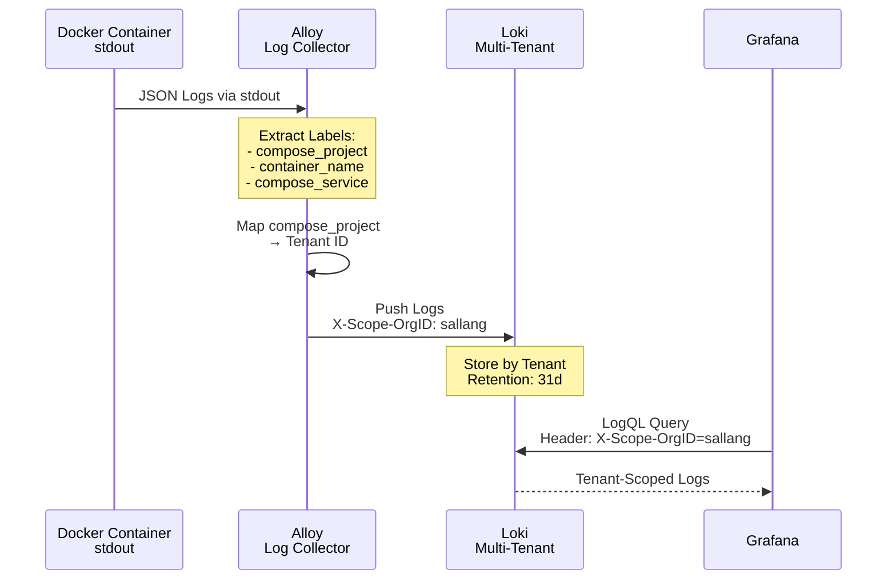

### 트레이스 수집 (Tempo)

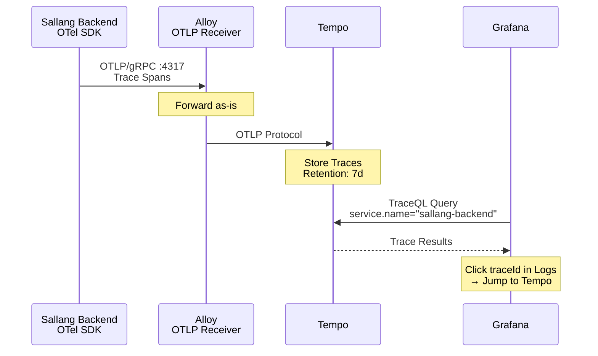

---

## 🔐 Multi-Tenancy 구조

### Tenant 격리 모델

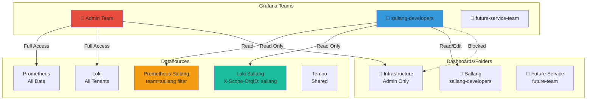

---

## 🔍 Prometheus Service Discovery

### Docker SD 자동 감지 흐름

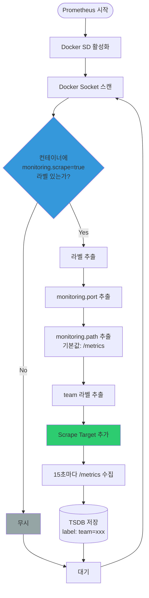

**자동 감지 예시:**

```yaml
# docker-compose.yml
services:
  backend:
    labels:
      - "monitoring.scrape=true" # ← SD가 감지
      - "monitoring.port=8080" # ← 포트
      - "monitoring.path=/actuator/prometheus" # ← 경로
      - "team=sallang" # ← 팀 식별
```

---

## 🗂️ 생성된 파일 목록

### 1. Ansible Role 구조 (`roles/monitoring/`)

```
roles/monitoring/
├── defaults/main.yml                      # 기본값 변수 정의
├── handlers/main.yml                      # 컨테이너 재시작 핸들러
├── tasks/
│   ├── main.yml                          # 오케스트레이션 (실행 순서)
│   ├── network.yml                       # monitoring-net 생성
│   ├── directories.yml                   # /etc/monitoring/* 디렉토리 생성
│   ├── prometheus.yml                    # Prometheus + Alertmanager 배포
│   ├── loki.yml                          # Loki 배포
│   ├── tempo.yml                         # Tempo 배포
│   ├── grafana.yml                       # Grafana 배포
│   ├── exporters.yml                     # Node Exporter + cAdvisor 배포
│   └── alloy.yml                         # Grafana Alloy 배포
└── templates/
    ├── prometheus.yml.j2                 # Prometheus 설정 + Docker SD
    ├── alert_rules_infra.yml.j2          # 인프라 알림 룰
    ├── alert_rules_sallang.yml.j2        # Sallang 서비스 알림 룰
    ├── loki.yml.j2                       # Loki 설정 (Multi-tenancy)
    ├── tempo.yml.j2                      # Tempo 설정 (OTLP)
    ├── alertmanager.yml.j2               # Alertmanager 설정
    ├── alloy.river.j2                    # Alloy River DSL 설정
    ├── grafana.ini.j2                    # Grafana 기본 설정
    ├── datasources.yml.j2                # Datasource provisioning
    └── dashboards.yml.j2                 # Dashboard provisioning
```

**총 21개 파일 생성**

---

### 2. 인벤토리 변수 (`inventory/group_vars/all/vars`)

추가된 변수:

```yaml
# 네트워크
monitoring_network_name: "monitoring-net"

# 컴포넌트 버전
prometheus_version: "latest"
loki_version: "latest"
tempo_version: "latest"
grafana_version: "latest"
alloy_version: "latest"
alertmanager_version: "latest"

# 데이터 보존 기간
prometheus_retention: "15d"
loki_retention: "744h"
tempo_retention: "168h"

# Grafana 설정 (Vault 참조)
grafana_admin_user: "{{ vault_grafana_admin_user }}"
grafana_admin_password: "{{ vault_grafana_admin_password }}"
```

---

### 3. Playbook 업데이트 (`playbooks/site.yml`)

```yaml
roles:
  - common
  - cpu_power_management
  - docker
  - traefik
  - ddns
  - fail2ban
  - homepage
  - tailscale
  - monitoring # 추가
```

---

### 4. Homepage 업데이트 (`roles/homepage/templates/services.yaml.j2`)

새 섹션 추가:

```yaml
- Monitoring:
    - Grafana:
        icon: grafana
        href: "https://grafana.{{ domain_name }}"
        description: "Metrics, Logs, Traces"
```

---

## 🔧 주요 설정 상세

### 1. Prometheus 설정 (`prometheus.yml.j2`)

**Scrape Configs:**

- `prometheus` (self-monitoring)
- `node-exporter` (시스템 메트릭)
- `cadvisor` (컨테이너 메트릭)
- `loki`, `tempo`, `grafana` (모니터링 스택 자체 메트릭)
- `docker-services` (Docker SD를 통한 자동 감지)

**Alert Rules:**

- 인프라: CPU/메모리/디스크 사용량, Node Down 등
- Sallang: 컨테이너 다운, 에러율, 레이턴시, 큐 길이 등

---

### 2. Loki 설정 (`loki.yml.j2`)

**핵심 설정:**

```yaml
auth_enabled: true # Multi-tenancy 활성화
retention_period: 744h # 31일
storage: filesystem
compactor:
  delete_request_store: filesystem # Retention 필수 설정
```

**Compactor:**

- 자동 압축 및 보존 기간 관리
- 10분 간격으로 실행

---

### 3. Tempo 설정 (`tempo.yml.j2`)

**OTLP Receiver:**

- gRPC: 포트 4317
- HTTP: 포트 4318

**보존 기간:** 168h (7일)

---

### 4. Alloy 설정 (`alloy.river.j2`)

**River DSL 기반 파이프라인:**

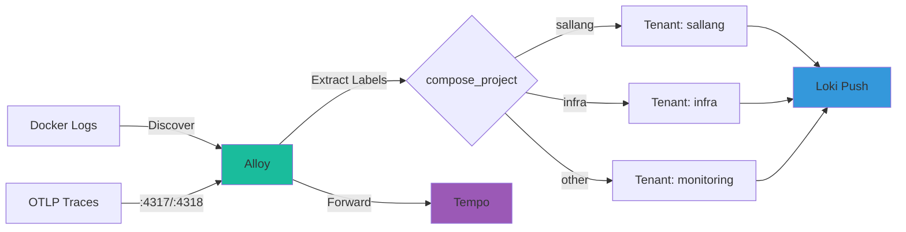

---

### 5. Alertmanager 설정 (`alertmanager.yml.j2`)

**현재 상태:**

- Slack 알림 비활성화
- `null` receiver 사용
- 알림은 Alertmanager UI와 Grafana에서만 확인 가능

**나중에 Slack 활성화 방법:**

- Jinja2 주석 내부에 전체 설정 예시 포함

---

## 📊 리소스 제한

| 컨테이너      | 메모리 제한 | CPU 제한 |
| ------------- | ----------- | -------- |
| Prometheus    | 1GB         | 1.0      |
| Loki          | 512MB       | 0.5      |
| Tempo         | 512MB       | 0.5      |
| Grafana       | 512MB       | 0.5      |
| Alloy         | 256MB       | 0.25     |
| Alertmanager  | 128MB       | 0.25     |
| Node Exporter | 128MB       | 0.25     |
| cAdvisor      | 256MB       | 0.5      |

**총 메모리:** ~3.3GB (30GB RAM 서버에서 11% 사용)

---

## 🔐 보안 및 접근 제어

### Grafana 접근 흐름

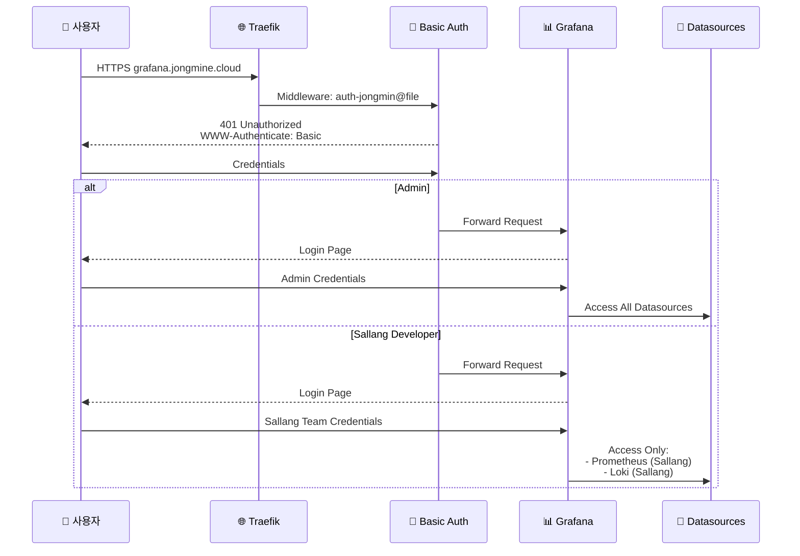

**Admin 계정:**

- URL: `https://grafana.jongmine.cloud`
- Traefik Basic Auth: `auth-jongmin@file` 미들웨어
- Grafana 로그인: Vault에 저장된 계정

**Sallang 팀 계정 (생성 예정):**

- 팀 전용 Datasource만 접근 가능
- `Sallang` 폴더만 읽기 권한
- Infrastructure 폴더 접근 불가

### Alertmanager UI

**접근 방법:**

- Tailscale VPN 통해 `http://<서버-tailscale-ip>:9093`
- 외부 노출 없음 (내부 네트워크만)

---

## 🐛 해결한 이슈

### 문제 해결 타임라인

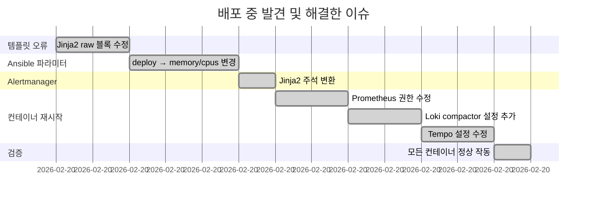

### 1. Jinja2 템플릿 문법 오류

**문제:** Prometheus 템플릿 변수(`{{ $value }}`)를 Jinja2가 해석 시도
**해결:** `` 블록으로 감싸서 해결

### 2. Ansible `docker_container` 모듈 파라미터 오류

**문제:** `deploy.resources.limits` 파라미터 미지원
**해결:** `memory`, `cpus` 파라미터를 직접 사용

### 3. Alertmanager 템플릿 변수 오류

**문제:** YAML 주석(`#`) 내부의 Jinja2 변수도 평가됨
**해결:** Jinja2 주석(`{# #}`)으로 변경

### 4. Prometheus 권한 오류

**문제:** `/prometheus/queries.active: permission denied`
**해결:** 데이터 디렉토리 소유권 `65534:65534`로 변경

### 5. Loki 설정 오류

**문제:** `compactor.delete-request-store` 미설정
**해결:** `delete_request_store: filesystem` 추가

### 6. Tempo 설정 오류

**문제:** 잘못된 `compactor` 필드 사용
**해결:** Tempo 설정 구조 수정

---

## ✅ 배포 상태

**현재 진행 상황:**

- ✅ 모든 Ansible 파일 생성 완료
- ✅ Vault 변수 추가 완료
- ✅ DNS 설정 완료
- ✅ 실제 배포 완료
- ✅ 모든 컨테이너 정상 작동

**컨테이너 상태:**

```
prometheus    Up 3 minutes   ✅
loki          Up 2 minutes   ✅
tempo         Up 2 minutes   ✅
grafana       Up 17 minutes  ✅
alloy         Up 17 minutes  ✅
alertmanager  Up 17 minutes  ✅
node-exporter Up 17 minutes  ✅
cadvisor      Up 17 minutes  ✅
```

---

## 📝 다음 단계

### 배포 후 작업 로드맵


### 1. Grafana 초기 설정 (Phase 9)

- ✅ Datasource 연결 테스트
- 📋 커뮤니티 대시보드 Import:
  - Node Exporter Full (ID: 1860)
  - Docker Container & Host (ID: 893)
  - Loki Dashboard (ID: 13639)
  - Traefik v3 (ID: 17346)
- 👥 sallang-developers 팀 생성 및 권한 설정

### 2. 백엔드 연동 (Phase 11)

- 📄 `MONITORING_BACKEND_GUIDE.md` 전달
- ⏳ 백엔드팀 변경사항 배포 대기
- ✅ 메트릭/로그/트레이스 수집 검증

### 3. 알림 설정 (선택사항)

- 🔔 Slack Webhook URL 설정
- 📧 Alertmanager 설정 업데이트

---

## 📚 관련 문서

| 문서                                   | 설명                                              |
| -------------------------------------- | ------------------------------------------------- |
| `MONITORING_DESIGN.md`                 | 전체 설계 문서 (아키텍처, 권한 모델, 데이터 흐름) |
| `MONITORING_BACKEND_GUIDE.md`          | 백엔드팀 연동 가이드                              |
| `PLAN.md`                              | 단계별 체크리스트 (Phase 0~12)                    |
| `MONITORING_IMPLEMENTATION_SUMMARY.md` | 본 문서 (작업 완료 내역)                          |

---

## 🔍 코드 리뷰 포인트

### 검토 필요 항목

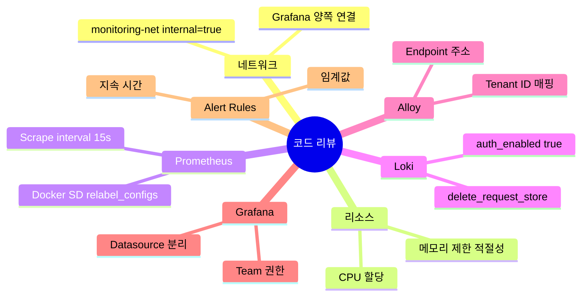

1. **네트워크 설정 (`tasks/network.yml`)**
   - `internal: true` 설정 확인

2. **리소스 제한 (`defaults/main.yml`)**
   - 메모리/CPU 제한값 적절성

3. **Prometheus 설정 (`templates/prometheus.yml.j2`)**
   - Scrape interval (15s)
   - Docker SD relabel_configs

4. **Loki 설정 (`templates/loki.yml.j2`)**
   - Multi-tenancy `auth_enabled: true`
   - Retention 설정
   - `delete_request_store: filesystem`

5. **Alloy 설정 (`templates/alloy.river.j2`)**
   - Tenant ID 매핑 로직
   - Loki/Tempo endpoint 주소

6. **Grafana Datasources (`templates/datasources.yml.j2`)**
   - Admin/Sallang 분리 설정
   - HTTP 헤더 및 쿼리 파라미터

7. **Alert Rules (`templates/alert_rules_*.yml.j2`)**
   - 임계값 적절성
   - 알림 조건 및 지속 시간

---

**작업 완료 시각:** 2026-02-20 09:00 (모든 컨테이너 정상 작동 확인)
