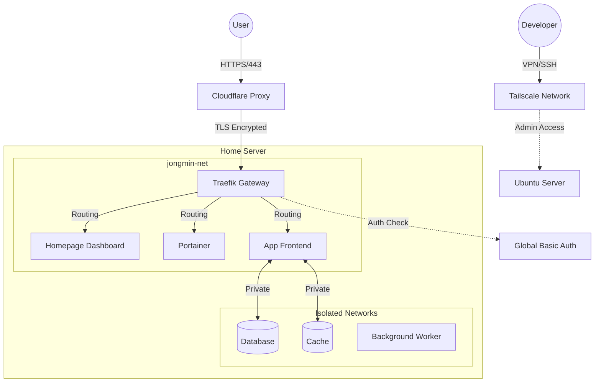

# 🏠 Jongmin's Home Server Infrastructure

## 🏗️ System Architecture

이 서버는 **Proxy Tier** 전략을 통해 보안과 접근성을 분리합니다.



## 📂 Project Structure

```bash
.
├── ansible.cfg               # Ansible 설정
├── inventory/                # 서버 접속 정보
├── playbooks/                # 메인 배포 스크립트 (site.yml)
├── roles/                    # Ansible Roles (Core Infra)
│   ├── common/               # 기본 설정
│   ├── docker/               # Docker Engine & Portainer
│   ├── traefik/              # Gateway & SSL
│   ├── homepage/             # Dashboard
│   ├── tailscale/            # VPN
│   └── ...
├── docs/                     # 📚 Documentation
│   ├── CD_SCRIPT_GUIDE.md    # [중요] 서비스 배포 가이드
│   ├── ACCOUNT_..._MGMT.md   # 계정 및 권한 관리
│   ├── ANSIBLE_DOCKER_GUIDE.md # 인프라 vs 앱 관리 기준
│   └── ...
└── README.md                 # 이 파일
```

## 🚀 Quick Start

### 1. Prerequisites

- **Ubuntu 24.04 LTS**
- **Ansible** 설치 (`brew install ansible`)
- **Git Clone** & **Vault 설정** (`cp all_vault.yml.template all_vault.yml`)

### 2. Configure Inventory

`inventory/hosts.yml` 파일에서 타겟 서버의 IP를 수정하세요.

```yaml
ansible_host: 192.168.x.x # 실제 서버 IP 입력
```

### 3. Deploy Infrastructure

```bash
ansible-playbook -i inventory/hosts.yml playbooks/site.yml
```

---

## 📚 Documentation Index

### 1. 배포 및 운영 (For Developers & Agents)

- [**서비스 배포 가이드 (CD Guide)**](docs/CD_SCRIPT_GUIDE.md): 새로운 서비스를 배포할 때 가장 먼저 읽어야 할 문서. 네트워크 구조와 CD 스크립트 템플릿을 제공합니다.
- [**Docker 운영 전략**](docs/ANSIBLE_DOCKER_GUIDE.md): Ansible로 관리하는 것과 Portainer로 관리하는 것의 차이를 설명합니다.
- [**Portainer 가이드**](docs/PORTAINER_GUIDE.md): GUI를 이용한 컨테이너 모니터링 및 임시 배포 방법.

## 🛡️ 보안 정책 (Security Policy)

이 서버는 Traefik 미들웨어를 사용하여 서비스별로 접근 제어를 수행합니다.

### 전역 인증 (Basic Auth) 적용 대상
다음의 핵심 인프라 서비스는 접속 시 전역 인증(`auth-jongmin`)이 필요합니다.
- **Homepage**: `https://jongmine.cloud`
- **Traefik Dashboard**: `https://traefik.jongmine.cloud`
- **Portainer**: `https://portainer.jongmine.cloud`
- **Glances**: `https://glances.jongmine.cloud`

### 서비스별 설정 가이드
- **공개 서비스 (API 등)**: 별도의 미들웨어 설정 없이 배포하면 외부에서 자유롭게 접근 가능합니다.
- **비공개 서비스**: 보안이 필요한 경우 Docker Label에 `traefik.http.routers.[name].middlewares=auth-jongmin@file`을 추가해야 합니다.
- 상세 설정 방법은 [**서비스 배포 가이드**](docs/CD_SCRIPT_GUIDE.md)를 참고하세요.

## 🛠️ 시작하기 (Getting Started)

### 2. 인프라 상세 (For Admins)

- [**Traefik 가이드**](docs/TRAEFIK_GUIDE.md): 게이트웨이 아키텍처, 전역 인증, 라우팅 상세 설정.
- [**Homepage 가이드**](docs/HOMEPAGE_GUIDE.md): 대시보드 위젯 커스터마이징.
- [**Tailscale ACL 가이드**](docs/TAILSCALE_ACL_GUIDE.md): VPN 접근 제어 정책 JSON 가이드.

### 3. 보안 및 권한

- [**계정 및 권한 관리**](docs/ACCOUNT_AND_PERMISSION_MANAGEMENT.md): `sallang-deploy` 등 서비스 계정의 역할과 Sudo 권한 상세.

### 4. 기타

- [**트러블슈팅**](docs/TROUBLESHOOTING.md): 자주 발생하는 문제 해결.
- [**네트워크 장애 리포트**](docs/NETWORK_INCIDENT_REPORT_20260115.md): 과거 장애 이력.
