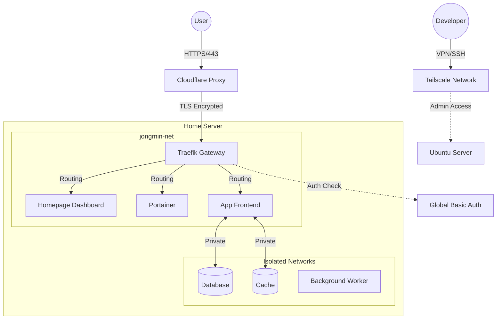

# 🏠 Jongmin's Home Server Infrastructure

## 🏗️ System Architecture

이 서버는 **Proxy Tier** 전략을 통해 보안과 접근성을 분리합니다.



## 📂 Project Structure

```bash
.
├── ansible.cfg               # Ansible 설정
├── inventory/
│   ├── hosts.yml             # 서버 접속 정보
│   └── group_vars/all/
│       ├── vars              # 공개 변수
│       ├── vault.example     # 민감 변수 예시
│       └── vault             # 민감 정보 (평문 로컬 파일, gitignore)
├── playbooks/                # 메인 배포 스크립트 (site.yml)
├── roles/                    # Ansible Roles (Core Infra)
│   ├── common/
│   │   ├── defaults/         # 기본값 변수
│   │   └── tasks/            # 기본 설정
│   ├── cpu_power_management/
│   │   ├── defaults/         # 기본값 변수
│   │   ├── tasks/            # CPU 부스트 비활성화
│   │   ├── templates/        # Systemd 서비스 템플릿
│   │   └── handlers/         # 재시작 핸들러
│   ├── docker/
│   │   ├── defaults/         # 기본값 변수
│   │   └── tasks/            # Docker Engine & Portainer
│   ├── traefik/
│   │   ├── defaults/         # 기본값 변수
│   │   ├── tasks/            # Gateway & SSL
│   │   ├── templates/        # 설정 파일 템플릿
│   │   └── handlers/         # 재시작 핸들러
│   ├── homepage/             # Dashboard
│   ├── tailscale/            # VPN
│   ├── ddns/                 # Dynamic DNS 업데이트
│   ├── fail2ban/             # 침입 차단 (Brute-force 방어)
│   └── monitoring/           # Grafana / Prometheus / Loki / Tempo 스택
├── docs/                     # 📚 Documentation
│   ├── CD_SCRIPT_GUIDE.md              # [중요] 서비스 배포 가이드
│   ├── MONITORING_GUIDE.md             # 모니터링 스택 가이드
│   ├── TROUBLESHOOTING.md              # 트러블슈팅 모음
│   ├── ANSIBLE_DOCKER_GUIDE.md         # 인프라 vs 앱 관리 기준
│   ├── ACCOUNT_AND_PERMISSION_MANAGEMENT.md # 계정 및 권한 관리
│   ├── TRAEFIK_GUIDE.md                # 게이트웨이 상세 설정
│   ├── HOMEPAGE_GUIDE.md               # 대시보드 커스터마이징
│   ├── TAILSCALE_ACL_GUIDE.md          # VPN 접근 제어 정책
│   └── PORTAINER_GUIDE.md              # 컨테이너 GUI 관리
└── README.md                 # 이 파일
```

### 변수 관리 원칙

Ansible Best Practices를 따라 변수를 체계적으로 관리합니다:

- **공개 변수** (`inventory/group_vars/all/vars`): 도메인, 네트워크 이름 등
- **민감 변수 예시** (`inventory/group_vars/all/vault.example`): 필요한 secret key 목록
- **민감 변수 실제값** (`inventory/group_vars/all/vault`): API 토큰, 비밀번호 등 (`vault_` 접두사). 이 파일은 평문 로컬 파일이며 git에 커밋하지 않습니다.
- **Role 기본값** (`roles/*/defaults/main.yml`): 각 role의 기본 설정값

#### 변수 추가 방법

**공개 변수 추가**:

```bash
vi inventory/group_vars/all/vars
```

**민감 변수 추가**:

```bash
# 1. vars 파일에 참조 추가
echo 'new_token: "{{ vault_new_token }}"' >> inventory/group_vars/all/vars

# 2. vault.example에 새 키를 placeholder로 추가
echo 'vault_new_token: "REPLACE_WITH_SECRET_NEW_TOKEN"' >> inventory/group_vars/all/vault.example

# 3. 실제 secret store / CI secrets에 값을 등록

# 4. 로컬 평문 vault 파일에 실제 값 추가
vi inventory/group_vars/all/vault
```

## 🚀 Quick Start

### 1. Prerequisites

- **Ubuntu 24.04 LTS**
- **Ansible** 설치 (`brew install ansible`)
- **Git Clone** & **Secret 설정**

```bash
# 민감 변수 예시를 로컬 vault 파일로 복사
cp inventory/group_vars/all/vault.example inventory/group_vars/all/vault

# 로컬 vault 파일 편집 (실제 API 토큰 등 입력)
vi inventory/group_vars/all/vault
```

`inventory/group_vars/all/vault`는 `.gitignore` 대상입니다. 실제 값은 별도의 secret manager 또는 CI/CD secrets에 등록하고, 로컬 실행 시에만 평문 파일로 생성하세요.

### 2. Configure Inventory

`inventory/hosts.yml` 파일에서 타겟 서버의 IP를 수정하세요.

```yaml
ansible_host: 192.168.x.x # 실제 서버 IP 입력
```

### 3. Secret 관리 원칙

이 저장소에서는 실제 secret 파일을 커밋하지 않습니다.

- `inventory/group_vars/all/vault.example`만 커밋합니다.
- `inventory/group_vars/all/vault`는 평문 로컬 파일로 두고 gitignore합니다.
- 운영/CI에서 필요한 값은 GitHub Actions Secrets, 1Password, Doppler, SOPS 등 별도 secret store에 등록합니다.
- 과거에 커밋된 secret은 gitignore만으로 폐기되지 않으므로, 노출 가능성이 있는 토큰은 회전해야 합니다.

### 4. Deploy Infrastructure

```bash
# 로컬 평문 vault 파일로 실행
ansible-playbook -i inventory/hosts.yml playbooks/site.yml

# Dry-run (변경사항 미리 확인)
ansible-playbook -i inventory/hosts.yml playbooks/site.yml --check --diff
```

---

## 📚 Documentation Index

### 1. 배포 및 운영 (For Developers & Agents)

- [**서비스 배포 가이드 (CD Guide)**](docs/CD_SCRIPT_GUIDE.md): 새로운 서비스를 배포할 때 가장 먼저 읽어야 할 문서. 네트워크 구조와 CD 스크립트 템플릿을 제공합니다.
- [**Docker 운영 전략**](docs/ANSIBLE_DOCKER_GUIDE.md): Ansible로 관리하는 것과 Portainer로 관리하는 것의 차이를 설명합니다.
- [**Portainer 가이드**](docs/PORTAINER_GUIDE.md): GUI를 이용한 컨테이너 모니터링 및 임시 배포 방법.
- [**모니터링 가이드**](docs/MONITORING_GUIDE.md): Grafana / Prometheus / Loki / Tempo 스택 운영 및 대시보드 가이드.
- [**트러블슈팅 가이드**](docs/TROUBLESHOOTING.md): 자주 발생하는 문제 해결 방법 모음.

## 🛡️ 보안 정책 (Security Policy)

이 서버는 Traefik 미들웨어를 사용하여 서비스별로 접근 제어를 수행합니다.

### 전역 인증 (Basic Auth) 적용 대상

다음의 핵심 인프라 서비스는 접속 시 전역 인증(`auth-jongmin`)이 필요합니다.

- **Homepage**: `https://jongmine.cloud`
- **Traefik Dashboard**: `https://traefik.jongmine.cloud`
- **Portainer**: `https://portainer.jongmine.cloud`
- **Glances**: `https://glances.jongmine.cloud`

### 서비스별 설정 가이드

- **공개 서비스 (API 등)**: 별도의 미들웨어 설정 없이 배포하면 외부에서 자유롭게 접근 가능합니다.
- **비공개 서비스**: 보안이 필요한 경우 Docker Label에 `traefik.http.routers.[name].middlewares=auth-jongmin@file`을 추가해야 합니다.
- 상세 설정 방법은 [**서비스 배포 가이드**](docs/CD_SCRIPT_GUIDE.md)를 참고하세요.

## 🖥️ 서버 사양

| 항목         | 값                                               |
| ------------ | ------------------------------------------------ |
| **CPU**      | AMD Ryzen 7 4700U with Radeon Graphics (8 cores) |
| **메모리**   | 32GB RAM                                         |
| **Swap**     | 4GB                                              |
| **스토리지** | 512GB                                            |
| **OS**       | Ubuntu 24.04.4 LTS                               |

## 🛠️ 시작하기 (Getting Started)

### 2. 인프라 상세 (For Admins)

- [**Traefik 가이드**](docs/TRAEFIK_GUIDE.md): 게이트웨이 아키텍처, 전역 인증, 라우팅 상세 설정.
- [**Homepage 가이드**](docs/HOMEPAGE_GUIDE.md): 대시보드 위젯 커스터마이징.
- [**Tailscale ACL 가이드**](docs/TAILSCALE_ACL_GUIDE.md): VPN 접근 제어 정책 JSON 가이드.

### 3. 보안 및 권한

- [**계정 및 권한 관리**](docs/ACCOUNT_AND_PERMISSION_MANAGEMENT.md): `sallang-deploy` 등 서비스 계정의 역할과 Sudo 권한 상세.
