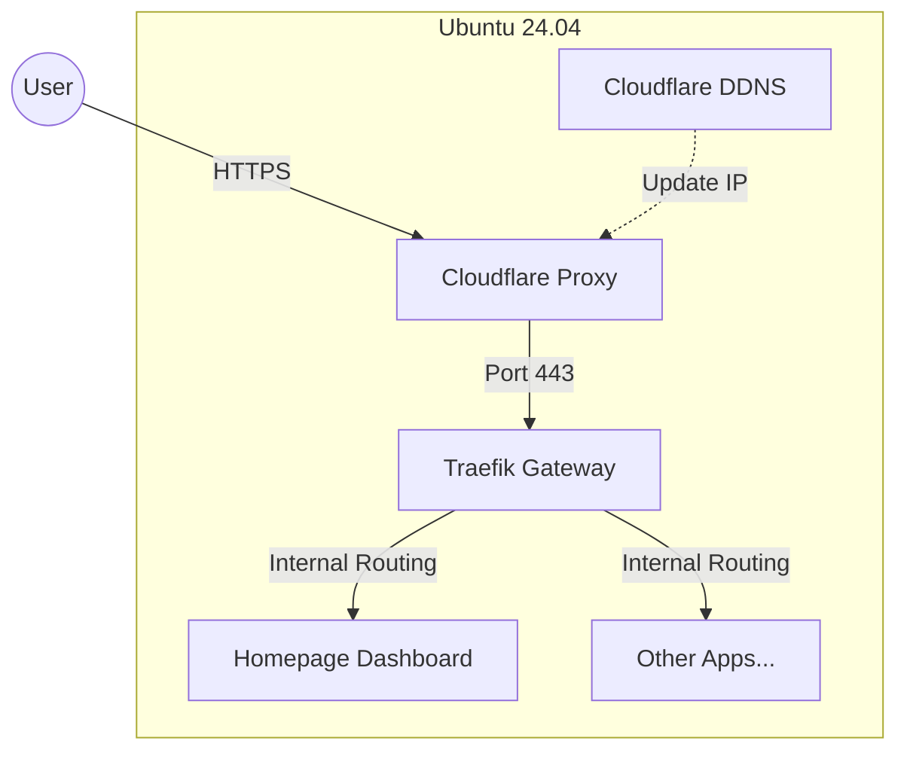

# 🏠 Jongmin's Home Server Infrastructure

서버가 초기화되더라도 이 레포지토리 하나면 **10분 안에** 모든 인프라(HTTPS, DDNS, 대시보드 등)를 완벽하게 복구할 수 있습니다.

## ⚖️ Operation Strategy

이 프로젝트는 **"단단한 인프라, 유연한 서비스"** 를 지향합니다.

1.  **Core Infrastructure (Ansible)**:
    - 서버의 뼈대(OS, Network, Traefik, Security)는 Ansible로 관리합니다.
    - **IaC (Infrastructure as Code)** 원칙을 준수하며, 수동 변경을 지양합니다.
2.  **Application & Dev (Portainer)**:
    - 실제 서비스나 개발용 컨테이너는 Portainer를 통해 유연하게 배포하고 관리합니다.
    - 개발자에게는 Portainer 접근 권한을 부여하여, 인프라를 건드리지 않고도 자유롭게 개발할 수 있는 환경(Sandbox)을 제공합니다.

## 🏗️ Architecture

- **OS**: Ubuntu Server 24.04 LTS
- **IaC**: Ansible (설정 자동화)
- **Container Runtime**: Docker CE (Latest)
- **Gateway (Reverse Proxy)**: Traefik v3 (HTTPS 자동화, 라우팅)
- **DNS & Security**: Cloudflare (DNS-01 Challenge, Proxy)
- **Dashboard**: Homepage (시스템 상태 및 서비스 모니터링)



## 📂 Project Structure

```bash
.
├── inventory/
│   ├── hosts.yml             # 서버 IP 및 접속 계정 정보
│   └── group_vars/
│       ├── all.yml           # 전역 변수 (도메인, 포트 등)
│       └── all_vault.yml     # [중요] 비밀 변수 (API 토큰, 비밀번호) - Git 제외됨
├── playbooks/
│   └── site.yml              # 전체 배포용 메인 플레이북
└── roles/
    ├── common/               # 기본 패키지(vim, curl 등) 및 시스템 설정
    ├── docker/               # Docker Engine 설치 및 네트워크 설정
    ├── traefik/              # Traefik 컨테이너 및 라우팅 설정
    ├── ddns/                 # Cloudflare DDNS 설정
    ├── homepage/             # 대시보드 및 위젯 설정
    └── fail2ban/             # UFW 방화벽 및 Fail2Ban 보안 설정
```

## 🚀 Quick Start

서버를 포맷했거나 새로 구축할 때 이 순서대로 진행하세요.

### 1. Prerequisites

- **Ubuntu 24.04 LTS** 설치 완료
- **SSH 접속** 가능 상태 (비밀번호 없이 Key 접속 권장)
- **Cloudflare 계정** 및 도메인 준비
- **Cloudflare API Token** 발급 (권한: `Zone.DNS` - Edit)

### 2. 컨트롤러 설정

Ansible이 설치되어 있어야 합니다. (Mac 기준)

```bash
brew install ansible
```

### 3. 프로젝트 설정

레포지토리를 클론하고 비밀 설정 파일을 생성합니다.

```bash
git clone <repository-url>
cd jongmin-server-infra

# 비밀 변수 템플릿 복사
cp inventory/group_vars/all_vault.yml.template inventory/group_vars/all_vault.yml

# 비밀 변수 입력 (Cloudflare 토큰, 이메일 등)
vi inventory/group_vars/all_vault.yml
```

`inventory/hosts.yml`에서 서버 IP가 맞는지 확인하세요.

```yaml
ansible_host: 192.168.200.100 # 실제 서버 IP로 변경
```

### 4. 전체 배포 실행

단 한 줄의 명령어로 모든 것을 설치합니다.

```bash
ansible-playbook -i inventory/hosts.yml playbooks/site.yml
```

### 5. 결과 확인

배포가 완료되면 브라우저에서 접속해 봅니다.

- **대시보드**: `https://jongmine.cloud`
- **Traefik 상태**: Homepage 위젯 또는 `http://<Server-IP>:8080/dashboard/`

## 🛠️ Maintenance

### 설정 변경 후 반영

설정 파일(예: Homepage 위젯 추가)을 수정한 후에는 다시 플레이북을 실행하면 변경된 부분만 반영됩니다.
특정 역할만 빠르게 실행하려면 태그를 사용하세요.

```bash
# Homepage 설정만 변경했을 때
ansible-playbook -i inventory/hosts.yml playbooks/site.yml --tags homepage
```

### 비밀번호 해시 생성

Traefik 대시보드나 서비스에 Basic Auth를 걸고 싶다면 `htpasswd` 해시를 생성하여 `all_vault.yml`에 넣으세요.

```bash
htpasswd -nbB user password
```

## 🔒 Security Note

- `inventory/group_vars/all_vault.yml` 파일은 **절대 Git에 커밋하지 마세요.** (.gitignore에 포함됨)
- 서버의 SSH 포트(22)는 키 기반 인증만 허용하는 것이 안전합니다.

* UFW 방화벽은 기본적으로 22, 80, 443, 8080 포트만 허용합니다.

## 📚 Documentation

- [**Traefik 가이드**](docs/TRAEFIK_GUIDE.md): 라우팅, 인증, 새로운 서비스 추가 방법.
- [**Homepage 가이드**](docs/HOMEPAGE_GUIDE.md): 대시보드 꾸미기, 위젯 설정법.
- [**Docker 운영 가이드**](docs/ANSIBLE_DOCKER_GUIDE.md): docker-compose 사용자를 위한 가이드.
- [**VPN 접속 가이드**](docs/VPN_ACCESS_GUIDE.md): Tailscale Zero Trust VPN 설정 및 외부 접속 방법.
- [**Portainer 가이드**](docs/PORTAINER_GUIDE.md): Portainer 도입 및 운영 전략.
- [**사용자 & 권한 관리**](docs/USER_MANAGEMENT.md): 계정 추가 및 보안 설정 가이드.
- [**개발자 협업 가이드**](docs/DEVELOPER_GUIDE.md): 외부 개발자를 위한 접속 및 배포 매뉴얼.
- [**트러블슈팅**](docs/TROUBLESHOOTING.md): 자주 묻는 질문과 해결책.
