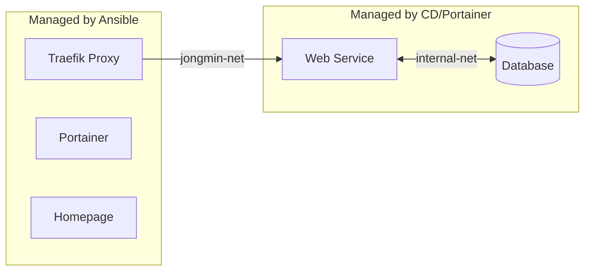

# 🐳 Docker Infrastructure Strategy

이 문서는 **"무엇을 Ansible로 관리하고, 무엇을 따로 관리하는가?"** 에 대한 기준을 제시합니다.

## 🏗️ Two-Track Strategy

이 서버는 유연성과 안정성을 위해 두 가지 방식으로 컨테이너를 관리합니다.

| 구분     | **Core Infrastructure**                     | **User Applications**              |
| :------- | :------------------------------------------ | :--------------------------------- |
| **대상** | Traefik, Homepage, Portainer, Glances, DDNS | 웹 서비스, DB, 개인 개발 프로젝트  |
| **도구** | **Ansible** (`roles/`)                      | **CD Pipeline** / **Portainer**    |
| **특징** | 변경 빈도 낮음, 시스템 전체에 영향          | 변경 빈도 높음, 서비스별 격리 필요 |
| **정의** | `tasks/main.yml` (docker_container 모듈)    | `docker-compose.yml` (Stacks)      |

---

## 1. Core Infrastructure (Ansible)

서버의 뼈대가 되는 서비스들은 Ansible Playbook으로 관리됩니다.
이들은 `docker-compose.yml` 파일이 없으며, Ansible Task가 그 역할을 대신합니다.

### 🔍 설정 확인 및 변경

설정 파일은 호스트의 `/etc/` 하위 경로에 마운트되어 관리됩니다.

- **Traefik**: `/etc/traefik/`
- **Homepage**: `/etc/homepage/`

### ➕ Core 서비스 추가 방법

새로운 **인프라급** 서비스(예: Monitoring Tool, Backup Tool)를 추가할 때만 사용하세요.

1. `roles/` 에 새로운 Role 생성.
2. `tasks/main.yml` 에 `docker_container` 모듈 작성.
3. `playbooks/site.yml` 에 등록.

---

## 2. User Applications (Docker Compose)

실제 우리가 사용하는 서비스나 개발 중인 앱은 **Ansible을 거치지 않고 배포**합니다.

### 🚀 배포 방법

1. **GitHub Actions (CD)**: [**CD 스크립트 가이드**](CD_SCRIPT_GUIDE.md)를 참고하여 자동 배포 파이프라인 구축.
2. **Portainer (Manual)**: [**Portainer 가이드**](PORTAINER_GUIDE.md)를 참고하여 GUI에서 `Stack`(Compose)으로 배포.

### 📝 Docker Compose 작성 원칙

모든 애플리케이션은 다음 규칙을 따라야 합니다:

1. **Gateway Network**: 웹 서버 컨테이너만 `jongmin-net`에 연결.
2. **Internal Network**: DB 등은 `default` 내부망에만 배치.
3. **Labels**: Traefik 라벨을 통해 도메인 및 HTTPS 연결.

