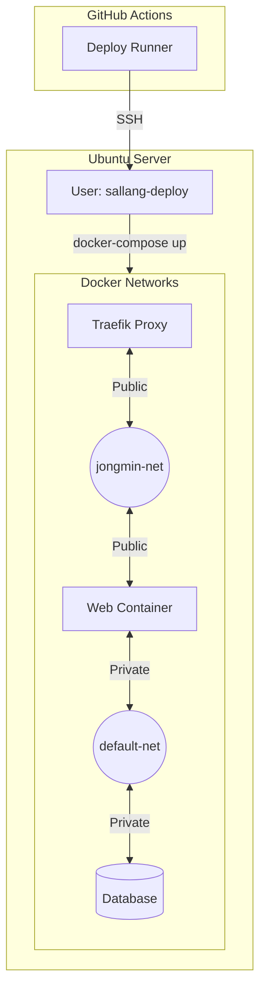

# 🚀 서비스 배포 가이드 (Deployment Guide)

이 문서는 **AI Agent** 및 **개발자**가 이 서버에 새로운 서비스를 배포하기 위한 표준 가이드입니다. GitHub Actions(CD) 스크립트 작성 시 이 문서를 참조하세요.

---

## 1. 📋 접속 및 계정 정보

### SSH 접속 (GitHub Actions용)

- **Host**: GitHub Secrets에 저장된 도메인 또는 공인 IP
- **Port**: `22`
- **Auth**: SSH Key (Passwordless)

### GitHub Secrets 필수 항목

레포지토리의 **Settings** -> **Secrets and variables** -> **Actions**에 다음이 설정되어야 합니다:

| Secret Name       | 설명                                          |
| ----------------- | --------------------------------------------- |
| `SSH_HOST`        | 서버 도메인 (예: `jongmine.cloud`)            |
| `SSH_USER`        | `sallang-deploy`                              |
| `SSH_PRIVATE_KEY` | `sallang-deploy` 계정의 Private Key 전체 내용 |

---

## 2. 🏗️ 네트워크 아키텍처ㄴ

이 서버는 **Traefik**을 메인 게이트웨이로 사용하는 **Proxy Tier** 전략을 따릅니다.

### Architecture Diagram



### 네트워크 구성 원칙

1.  **Gateway Network (`jongmin-net`)**:

    - **역할**: Traefik과 각 서비스의 **Web(Frontend) 컨테이너**가 만나는 곳입니다.
    - **연결 대상**: Traefik, 서비스의 웹 서버/프록시 컨테이너.
    - **금지 대상**: DB, Cache 등 내부 백엔드 서비스는 절대 이 네트워크에 직접 연결하지 마세요.

2.  **Service Internal Network (서비스별 내부망)**:
    - **역할**: 서비스 내부 구성요소(Web <-> DB) 간의 통신을 위한 격리된 네트워크입니다.
    - **특징**: `docker-compose.yml`에서 정의하는 기본 네트워크(`default`)를 사용합니다.

### 👥 서비스 계정 (`sallang-deploy`)의 역할

- `sallang-deploy` 계정은 **Docker Group**의 일원입니다. `sudo` 없이 Docker 명령을 실행할 수 있습니다.
- 배포 루트 디렉토리는 `/home/sallang-deploy/app` 입니다.

---

## 3. 📝 Docker Compose 작성 가이드

### 표준 `docker-compose.yml` 템플릿

모든 서비스는 **AWS t3.medium** 수준의 자원 할당량(Quota)을 준수해야 합니다.

```yaml
version: "3.8"

services:
  # 1. 웹 서비스 (Traefik에 노출)
  app:
    image: my-image:latest
    restart: unless-stopped
    networks:
      - jongmin-net # Traefik과 통신 (Gateway)
      - default # DB와 통신 (Internal)
    labels:
      - "traefik.enable=true"
      - "traefik.http.routers.myapp.rule=Host(`myapp.jongmine.cloud`)"
      - "traefik.http.routers.myapp.entrypoints=websecure"
      - "traefik.http.routers.myapp.tls.certresolver=cloudflare"
      # 서비스 포트 지정 (컨테이너 내부 포트)
      - "traefik.http.services.myapp.loadbalancer.server.port=3000"
      
      # [선택] 전역 Basic Auth 해제 (API 서비스의 경우 필수)
      # 설정을 비워두면(empty) 엔트리포인트의 전역 인증을 무시합니다.
      - "traefik.http.routers.myapp.middlewares="
    deploy:
      resources:
        limits:
          # AWS t3.medium급 자원 할당 (Policy)
          cpus: "2.00" # 2 vCPU
          memory: 4G # 4 GiB RAM

  # 2. 데이터베이스 (외부 격리)
  db:
    image: postgres:15
    restart: unless-stopped
    networks:
      - default # 오직 내부망만 연결 (jongmin-net 연결 금지!)
    environment:
      POSTGRES_PASSWORD: secure_password
    deploy:
      resources:
        limits:
          cpus: "1.00"
          memory: 1G

# 3. 네트워크 정의
networks:
  jongmin-net:
    external: true
  default: # 내부망 (자동 생성됨)
```

### 필수 체크리스트

- [ ] **Network**: Web 컨테이너만 `jongmin-net`에 연결했는가?
- [ ] **Isolation**: DB/Cache는 `jongmin-net`에서 제외했는가?
- [ ] **Labels**: `traefik.enable=true` 및 `websecure` 엔트리포인트를 설정했는가?
- [ ] **Auth**: 전역 인증(`auth-jongmin`)이 적용됨을 인지했는가? (별도 설정 없어도 자동 적용됨)
- [ ] **DNS**: 사용하는 도메인(`[서비스명].jongmine.cloud`)이 서버 IP를 가리키고 있는가? (안 된다면 관리자에게 DNS 등록 요청)
- [ ] **Resources**: `deploy.resources.limits`가 설정되어 있는가?

---

## 4. 🚀 GitHub Actions Workflow (CD)

### `.github/workflows/deploy.yml` 예시

```yaml
name: Deploy to Server

on:
  push:
    branches: [main]

jobs:
  deploy:
    runs-on: ubuntu-latest
    steps:
      - name: Checkout code
        uses: actions/checkout@v3

      - name: Deploy via SSH
        uses: appleboy/ssh-action@master
        with:
          host: ${{ secrets.SSH_HOST }}
          username: ${{ secrets.SSH_USER }}
          key: ${{ secrets.SSH_PRIVATE_KEY }}
          script: |
            # 1. 서비스 디렉토리 생성 (필수!)
            # 인프라 관리자는 ~/app 까지만 관리합니다. 서비스 디렉토리는 스스로 생성해야 합니다.
            mkdir -p /home/sallang-deploy/app/my-service
            cd /home/sallang-deploy/app/my-service

            # 2. 최신 코드/설정 배포 (git pull 또는 scp)
            # git pull origin main

            # 3. Docker 이미지 갱신 및 재시작
            # sallang-deploy는 docker 그룹 멤버이므로 sudo가 필요 없습니다.
            docker-compose pull
            docker-compose up -d --remove-orphans

            # 4. 정리
            docker image prune -f
```

---

## 5. 🔍 트러블슈팅

### Traefik 502 Bad Gateway

1.  **네트워크 확인**: 해당 컨테이너가 `jongmin-net`에 올바르게 연결되었는지 확인하세요.
    ```bash
    docker inspect [container_name] | grep jongmin-net
    ```
2.  **포트 확인**: `traefik....loadbalancer.server.port` 라벨이 컨테이너의 실제 내부 포트와 일치하는지 확인하세요.

### 권한 오류 (Permission Denied)

1.  **계정 확인**: `sallang-deploy` 계정으로 접속했는지 확인하세요.
2.  **디렉토리 권한**: `~/app` 하위 디렉토리를 생성할 수 없는 경우, 관리자에게 `/home/sallang-deploy/app` 권한(`775`) 확인을 요청하세요.
