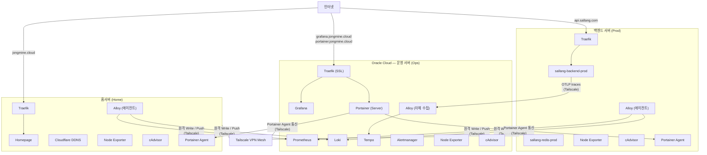
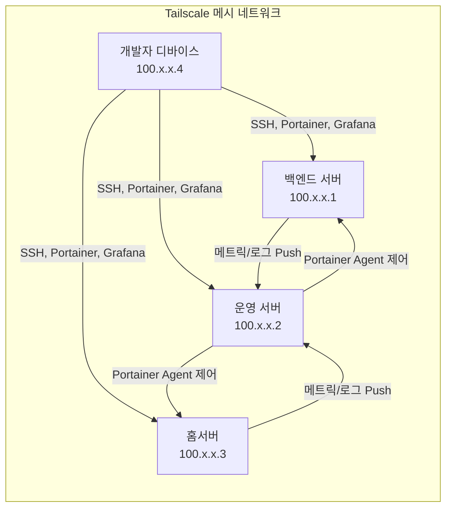
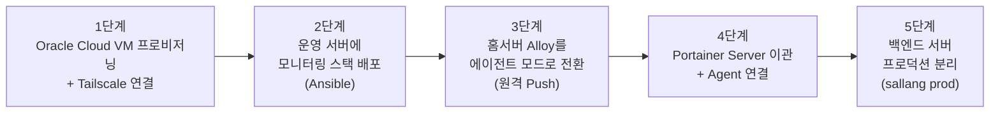

# Oracle Cloud 이관 전략 — 3-Node 아키텍처

> 작성일: 2026-03-20
> 현재 상태: 계획 단계 (단일 홈서버 → 3-Node 분리)

---

## 목표

현재 홈서버 단일 노드에 모든 서비스를 집약한 구조를 **역할 기반 3-Node**로 분리합니다.

- **백엔드 서버**: 프로덕션 API 전용
- **운영 서버** (Oracle Cloud): 모니터링 + 관리 중앙화
- **홈서버**: 개인 대시보드 및 유틸리티

---

## 목표 아키텍처



---

## 서버별 역할 정의

### 백엔드 서버 (Prod Backend)

| 항목      | 내용                       |
| --------- | -------------------------- |
| 도메인    | `api.sallang.com`          |
| 역할      | 프로덕션 API 서비스 전용   |
| 외부 노출 | HTTPS 443만 (Traefik 경유) |

**스택:**

- Traefik + sallang-backend-prod + sallang-redis-prod
- Alloy (에이전트 모드): 로그 수집 → 운영 서버 Loki로 원격 Push
- Node Exporter, cAdvisor → 운영 서버 Prometheus로 원격 수집
- Portainer Agent: 운영 서버 Portainer에서 원격 관리

**VPN 전용 접근:**

- SSH (22번 포트 외부 차단, Tailscale 내부망만 허용)
- Portainer Agent 통신
- 메트릭/로그 수집 포트

---

### 운영 서버 (Oracle Cloud — Ops & Monitoring)

| 항목   | 내용                                                 |
| ------ | ---------------------------------------------------- |
| 도메인 | `grafana.jongmine.cloud`, `portainer.jongmine.cloud` |
| 역할   | 모니터링 중앙화 + 전체 서버 컨테이너 관리            |
| Cloud  | Oracle Cloud (Always Free Tier 활용 가능)            |

**스택:**

- Traefik (SSL)
- **Grafana + Prometheus + Loki + Tempo + Alertmanager** (모니터링)
- **Portainer Server** (3개 서버 중앙 관리)
- Alloy + Node Exporter + cAdvisor (자체 모니터링)

**보안:**

- Grafana, Portainer 접근은 Tailscale VPN 내부 IP만 허용 (Traefik 미들웨어로 제한)
- 외부 공인 IP 노출 최소화

---

### 홈서버 (Home / Portal)

| 항목   | 내용                      |
| ------ | ------------------------- |
| 도메인 | `jongmine.cloud`          |
| 역할   | 개인 대시보드 및 유틸리티 |

**스택:**

- Homepage (전체 서비스 링크 포털)
- Cloudflare DDNS (유동 IP 관리)
- Traefik
- Alloy + Node Exporter + cAdvisor → 운영 서버로 원격 전송
- Portainer Agent

---

## Tailscale VPN 전략



| 서버      | 공인 IP 노출         | VPN 전용                                      |
| --------- | -------------------- | --------------------------------------------- |
| 백엔드    | HTTPS 443 (API)      | SSH, Portainer Agent, 메트릭 포트             |
| 운영 서버 | 없음 (또는 최소)     | Grafana, Portainer, Loki/Prometheus 수집 포트 |
| 홈서버    | HTTPS 443 (Homepage) | SSH, 개인 서비스, 메트릭 포트                 |

---

## Alloy 에이전트 원격 전송 설정

백엔드/홈서버의 Alloy는 로컬 Loki 없이 운영 서버로 직접 Push합니다.

```river
// 에이전트 모드 — 운영 서버 Loki로 원격 Push
loki.write "remote_loki" {
  endpoint {
    url       = "http://100.x.x.2:3100/loki/api/v1/push"  // Tailscale IP
    tenant_id = ""
  }
}
```

Prometheus 메트릭은 운영 서버 Prometheus의 `remote_write` 또는 Federation으로 수집합니다.

---

## 이관 순서



| 단계 | 작업                                 | 전제 조건              |
| ---- | ------------------------------------ | ---------------------- |
| 1    | Oracle Cloud VM 생성, Tailscale 설치 | Oracle 계정 준비       |
| 2    | 운영 서버에 모니터링 role 배포       | Ansible inventory 추가 |
| 3    | 홈서버 Alloy → 원격 Push 전환        | 2단계 완료             |
| 4    | Portainer를 운영 서버로 이관         | 3단계 완료             |
| 5    | sallang prod 환경 분리               | 별도 기획              |

---

## Ansible 구조 변경 계획

현재 단일 `[homeserver]` 인벤토리를 3개 그룹으로 분리합니다.

```ini
# inventory/hosts.yml (목표 구조)
[backend]
sallang-backend-prod ansible_host=100.x.x.1

[ops]
jongmin-ops ansible_host=100.x.x.2

[home]
jongmin-server ansible_host=100.x.x.3

[monitoring:children]
ops

[agents:children]
backend
home
```

Role 분리:

| Role               | 대상          | 내용                             |
| ------------------ | ------------- | -------------------------------- |
| `monitoring`       | ops           | 전체 LGTM 스택 (현재와 동일)     |
| `monitoring-agent` | backend, home | Alloy + Node Exporter + cAdvisor |
| `portainer-server` | ops           | Portainer Server                 |
| `portainer-agent`  | backend, home | Portainer Agent                  |

---

## Oracle Cloud 고려사항

- **Always Free Tier**: ARM64 VM (4 OCPU, 24GB RAM) 무료 제공 → 모니터링 스택에 충분
- **네트워크**: Oracle VCN Security List에서 Tailscale UDP 41641 포트 허용 필요
- **스토리지**: Block Volume 50GB 무료 → Loki/Prometheus 데이터 디렉터리 마운트

---

## 관련 문서

- [MONITORING_GUIDE.md](./MONITORING_GUIDE.md) — 현재 모니터링 스택 운영 가이드
- [TAILSCALE_ACL_GUIDE.md](./TAILSCALE_ACL_GUIDE.md) — Tailscale ACL 및 VPN 설정
- [ANSIBLE_DOCKER_GUIDE.md](./ANSIBLE_DOCKER_GUIDE.md) — Ansible 배포 가이드
