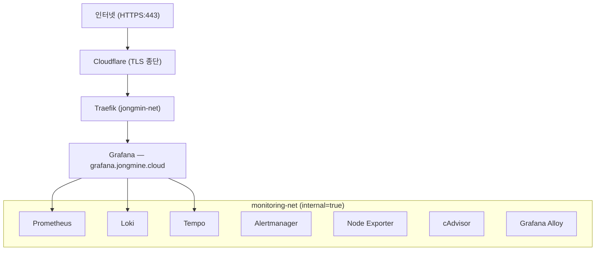
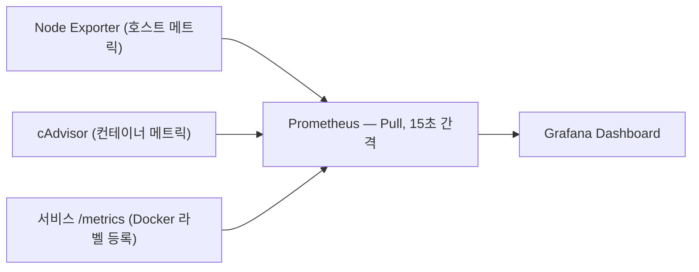
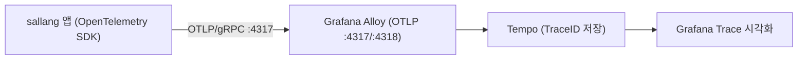
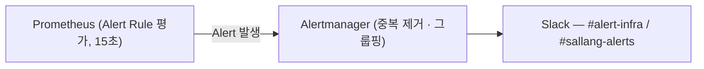

# 모니터링 스택 가이드

홈랩 서버에 구축된 **LGTM Stack** 기반 모니터링 시스템에 대한 안내입니다.

---

## 목차

1. [개요](#1-개요)
2. [아키텍처](#2-아키텍처)
3. [컴포넌트 설명](#3-컴포넌트-설명)
4. [데이터 흐름](#4-데이터-흐름)
5. [접근 방법](#5-접근-방법)
6. [권한 구조](#6-권한-구조)
7. [대시보드 목록](#7-대시보드-목록)
8. [알림 설정](#8-알림-설정)
9. [Ansible 배포](#9-ansible-배포)
10. [운영 팁](#10-운영-팁)

---

## 1. 개요

이 모니터링 스택은 Observability의 세 가지 핵심 요소를 단일 인터페이스로 제공합니다.

| 신호        | 도구       | 질문                           |
| ----------- | ---------- | ------------------------------ |
| **Metrics** | Prometheus | 지금 시스템이 얼마나 건강한가? |
| **Logs**    | Loki       | 무슨 일이 일어났는가?          |
| **Traces**  | Tempo      | 요청이 어느 경로로 처리됐는가? |

모든 데이터는 **Grafana** 하나에서 통합 조회할 수 있으며, **Grafana Alloy**가 수집 파이프라인을 담당합니다.

외부에서는 `https://grafana.jongmine.cloud` 하나의 진입점만 열려 있습니다. Prometheus, Loki, Tempo, Alertmanager는 모두 내부 네트워크에 격리되어 있어 직접 접근이 불가능합니다.

---

## 2. 아키텍처

### 전체 구성도



### 네트워크 분리

| 네트워크         | 용도                      | 외부 연결         |
| ---------------- | ------------------------- | ----------------- |
| `jongmin-net`    | Traefik 라우팅            | O (Traefik 경유)  |
| `monitoring-net` | 모니터링 서비스 내부 통신 | X (internal=true) |

Grafana만 두 네트워크에 모두 연결되어 있습니다. 나머지 모니터링 컴포넌트는 `monitoring-net`에만 속하며 Traefik을 통한 외부 노출이 없습니다.

---

## 3. 컴포넌트 설명

### 3.1 Prometheus — 메트릭 수집

**역할**: 시계열 데이터베이스. 15초 간격으로 각 서비스의 `/metrics` 엔드포인트를 Pull 방식으로 수집합니다.

**수집 대상**:

- Node Exporter (호스트 CPU/메모리/디스크/네트워크)
- cAdvisor (컨테이너별 리소스 사용량)
- Grafana, Loki, Tempo (자체 메트릭)
- Docker 라벨로 등록된 서비스 (`monitoring.scrape=true`)

**설정 파일**: `roles/monitoring/templates/prometheus.yml.j2`
**데이터 보존**: 15일
**포트**: 9090 (내부 전용)

새 서비스를 Prometheus에 등록하려면 Docker Compose에 다음 라벨을 추가하세요:

```yaml
labels:
  monitoring.scrape: "true"
  monitoring.port: "8080"
  monitoring.path: "/metrics"
  team: "sallang" # 팀 식별자 (알림 라우팅에 사용)
```

### 3.2 Loki — 로그 집계

**역할**: 로그 저장소. Elasticsearch와 달리 로그 내용은 인덱싱하지 않고 레이블만 인덱싱하여 리소스를 적게 사용합니다.

**테넌트 분리 (Multi-Tenancy)**:

| Tenant ID    | 포함 서비스                                 |
| ------------ | ------------------------------------------- |
| `infra`      | traefik, homepage, portainer, glances, 기타 |
| `sallang`    | sallang-api, sallang-worker 등              |
| `monitoring` | prometheus, loki, tempo, grafana, alloy     |

Alloy가 Docker `compose_project` 라벨을 보고 Tenant ID를 자동으로 부여합니다.

**설정 파일**: `roles/monitoring/templates/loki.yml.j2`
**데이터 보존**: 30일
**포트**: 3100 (내부 전용)

### 3.3 Tempo — 분산 트레이싱

**역할**: 분산 트레이싱 백엔드. sallang 앱에서 OpenTelemetry SDK로 생성된 Trace를 저장하고, Grafana에서 요청의 전체 호출 경로를 시각화합니다.

**수집 방식**:

- OTLP/gRPC → `alloy:4317`
- OTLP/HTTP → `alloy:4318`

앱에서 Alloy로 트레이스를 전송하면 Alloy가 Tempo로 라우팅합니다.

**설정 파일**: `roles/monitoring/templates/tempo.yml.j2`
**데이터 보존**: 7일
**포트**: 3200 (내부 전용)

### 3.4 Grafana — 통합 대시보드

**역할**: 모든 데이터 소스를 하나의 UI에서 조회하는 시각화 플랫폼.

**연결된 데이터 소스**:

- Prometheus (uid: `prometheus`)
- Loki (uid: `loki`) — infra tenant
- Loki Sallang (uid: `loki-sallang`) — sallang tenant 전용
- Tempo (uid: `tempo`) — 로그-트레이스 연동 포함

**외부 URL**: `https://grafana.jongmine.cloud`
**포트**: 3000

### 3.5 Alertmanager — 알림 라우팅

**역할**: Prometheus에서 발생한 알림을 수신하여 Slack으로 전송합니다. 중복 제거, 그룹핑, 침묵(Silence) 기능을 제공합니다.

**알림 채널**:

- `#alert-infra` — 인프라 알림 (critical, warning)
- `#sallang-alerts` — sallang 서비스 알림 (team=sallang 라벨)

**설정 파일**: `roles/monitoring/templates/alertmanager.yml.j2`
**포트**: 9093 (내부 전용)

### 3.6 Node Exporter — 호스트 메트릭

**역할**: 서버 하드웨어 및 OS 수준의 메트릭을 노출합니다.

**주요 메트릭**:

- `node_cpu_seconds_total` — CPU 사용률
- `node_memory_MemAvailable_bytes` — 사용 가능 메모리
- `node_filesystem_free_bytes` — 디스크 여유 공간
- `node_load1`, `node_load5`, `node_load15` — 시스템 로드

**포트**: 9100 (Host 네트워크 모드)

### 3.7 cAdvisor — 컨테이너 메트릭

**역할**: 실행 중인 Docker 컨테이너별 리소스 사용량을 노출합니다.

**주요 메트릭**:

- `container_cpu_usage_seconds_total` — 컨테이너 CPU
- `container_memory_usage_bytes` — 컨테이너 메모리
- `container_network_receive_bytes_total` — 네트워크 수신

**포트**: 8080 (내부 전용)

### 3.8 Grafana Alloy — 통합 에이전트

**역할**: 로그 수집(Promtail 대체) + OTLP 트레이스 수신을 하나의 에이전트에서 처리합니다.

**주요 기능**:

1. Docker 소켓을 감시하여 모든 컨테이너 로그 자동 수집
2. `compose_project` 라벨을 읽어 Loki Tenant ID 자동 부여
3. OTLP/gRPC(4317), OTLP/HTTP(4318) 수신 후 Tempo로 라우팅

**설정 파일**: `roles/monitoring/templates/alloy.river.j2`

---

## 4. 데이터 흐름

### 메트릭



### 로그


### 트레이스



### 알림



---

## 5. 접근 방법

### 외부 접근 (인터넷)

| 서비스  | URL                              | 비고        |
| ------- | -------------------------------- | ----------- |
| Grafana | `https://grafana.jongmine.cloud` | 로그인 필요 |

### 내부 접근 (Tailscale VPN 필요)

Tailscale 연결 후 서버 호스트네임으로 직접 접근 가능합니다.

| 서비스       | 주소                         | 용도                         |
| ------------ | ---------------------------- | ---------------------------- |
| Prometheus   | `http://jongmin-server:9090` | 쿼리 디버깅, 타겟 상태 확인  |
| Alertmanager | `http://jongmin-server:9093` | 알림 상태 확인, Silence 설정 |
| Loki         | `http://jongmin-server:3100` | 관리 API                     |
| Tempo        | `http://jongmin-server:3200` | 관리 API                     |

> Tailscale 설정은 [TAILSCALE_ACL_GUIDE.md](./TAILSCALE_ACL_GUIDE.md)를 참조하세요.

---

## 6. 권한 구조

모니터링 스택은 4개 계층으로 접근 권한을 분리합니다.

### 계층 1: 네트워크 격리

`monitoring-net`은 `internal: true`로 설정되어 외부 인터넷 접근이 차단됩니다. Grafana만 Traefik과 연결된 `jongmin-net`에 속합니다.

### 계층 2: Grafana RBAC

| 역할                   | 권한                                         |
| ---------------------- | -------------------------------------------- |
| **Admin** (jongmin)    | 전체 대시보드, 데이터소스, 사용자, 알림 관리 |
| **sallang-developers** | Sallang 폴더 조회만 가능 (수정 불가)         |

### 계층 3: Loki Multi-Tenancy

sallang-developers 팀의 Loki 데이터소스는 `X-Scope-OrgID: sallang` 헤더가 고정되어 있습니다. 다른 팀의 로그(`infra`, `monitoring` tenant)는 조회할 수 없습니다.

### 계층 4: Prometheus 레이블 필터

sallang 전용 Prometheus 데이터소스는 `team="sallang"` 레이블 필터가 걸려 있어 다른 서비스 메트릭은 조회할 수 없습니다.

---

## 7. 대시보드 목록

### Infrastructure 폴더 (Admin 전용)

| 대시보드                | 소스 파일                    | 내용                                   |
| ----------------------- | ---------------------------- | -------------------------------------- |
| Node Exporter Full      | `node-exporter-full.json`    | 호스트 CPU/메모리/디스크/네트워크 상세 |
| Docker Container & Host | `docker-container-host.json` | 컨테이너별 리소스 + 호스트 개요        |
| Loki Dashboard          | `loki-dashboard.json`        | 로그 볼륨, 수집 상태                   |
| Traefik v3              | `traefik-v3.json`            | HTTP 요청 현황, 에러율, 레이턴시       |

### Sallang 폴더 (sallang-developers + Admin)

| 대시보드    | 소스 파일                    | 내용                            |
| ----------- | ---------------------------- | ------------------------------- |
| Sallang APM | `sallang/apm-dashboard.json` | 서비스 오류율, 레이턴시, 처리량 |

### 대시보드 파일 위치

```
roles/monitoring/files/dashboards/
├── docker-container-host.json
├── loki-dashboard.json
├── node-exporter-full.json
├── traefik-v3.json
└── sallang/
    └── apm-dashboard.json
```

대시보드는 Grafana 재시작 없이 파일을 교체하고 배포하면 자동으로 반영됩니다.

---

## 8. 알림 설정

### 인프라 알림 규칙

`roles/monitoring/templates/alert_rules_infra.yml.j2`

| 알림 이름                | 조건                         | 지속 시간 |
| ------------------------ | ---------------------------- | --------- |
| HighCPUUsage             | CPU 사용률 > 80%             | 5분       |
| HighMemoryUsage          | 메모리 사용률 > 85%          | 5분       |
| DiskSpaceWarning         | 디스크 사용률 > 80%          | 5분       |
| DiskSpaceCritical        | 디스크 사용률 > 90%          | 2분       |
| NodeDown                 | Node Exporter 다운           | 1분       |
| ContainerDown            | 컨테이너 응답 없음           | 1분       |
| HighContainerMemoryUsage | 컨테이너 메모리 > 한도의 90% | 5분       |

### sallang 서비스 알림 규칙

`roles/monitoring/templates/alert_rules_sallang.yml.j2`

| 알림 이름                   | 조건                | 지속 시간 |
| --------------------------- | ------------------- | --------- |
| SallangContainerDown        | 컨테이너 다운       | 1분       |
| SallangHighErrorRate        | 5xx 에러율 > 1%     | 3분       |
| SallangHighLatency          | P99 레이턴시 > 2초  | 5분       |
| SallangMatchingQueueTooLong | 대기열 길이 > 1000  | 5분       |
| SallangHighMemoryUsage      | 메모리 > 한도의 85% | 5분       |

### 알림 침묵 (Silence)

점검 시 특정 알림을 일시 중단하려면 Alertmanager UI(`http://jongmin-server:9093`)에 접속하여 Silence를 등록하세요.

---

## 9. Ansible 배포

### 전체 모니터링 스택 배포

```bash
# Dry-run (변경 사항 미리 확인)
ansible-playbook playbooks/site.yml --check --diff --tags monitoring

# 실제 배포
ansible-playbook playbooks/site.yml --tags monitoring
```

### 컴포넌트별 태그

```bash
# Grafana만 재배포
ansible-playbook playbooks/site.yml --tags monitoring-grafana

# Prometheus + Alertmanager만 재배포
ansible-playbook playbooks/site.yml --tags monitoring-prometheus

# 대시보드 파일만 업데이트
ansible-playbook playbooks/site.yml --tags monitoring-grafana-dashboards
```

### Vault 변수 편집

Alertmanager Webhook URL, Grafana 관리자 비밀번호 등 민감한 정보는 Vault에 저장되어 있습니다. 절대 `inventory/group_vars/all/vault` 파일을 직접 편집하지 마세요.

```bash
ansible-vault edit inventory/group_vars/all/vault
```

### Role 파일 구조

```
roles/monitoring/
├── defaults/main.yml          # 버전, 포트, 리소스 제한 기본값
├── tasks/
│   ├── main.yml               # 배포 순서 정의
│   ├── network.yml            # monitoring-net 생성
│   ├── directories.yml        # 데이터 디렉터리 생성
│   ├── prometheus.yml         # Prometheus + Alertmanager
│   ├── loki.yml               # Loki
│   ├── tempo.yml              # Tempo
│   ├── grafana.yml            # Grafana
│   ├── exporters.yml          # Node Exporter + cAdvisor
│   ├── alloy.yml              # Grafana Alloy
│   └── grafana_dashboards.yml # 대시보드 프로비저닝
├── templates/                 # Jinja2 설정 파일
├── handlers/main.yml          # 컨테이너 재시작 핸들러
└── files/dashboards/          # Grafana 대시보드 JSON
```

---

## 10. 운영 팁

### 새 서비스 모니터링 추가

1. **메트릭**: Docker Compose에 라벨 추가

   ```yaml
   labels:
     monitoring.scrape: "true"
     monitoring.port: "8080"
     monitoring.path: "/metrics"
   ```

2. **로그**: 별도 설정 불필요. Alloy가 자동으로 Docker 로그를 수집합니다.

3. **트레이스**: 앱에 OpenTelemetry SDK를 추가하고 Alloy의 OTLP 엔드포인트로 전송하세요.
   - gRPC: `alloy:4317`
   - HTTP: `alloy:4318`

### 리소스 사용량 참고

| 컴포넌트      | 메모리 제한 | 예상 실사용 |
| ------------- | ----------- | ----------- |
| Prometheus    | 1GB         | ~300-500MB  |
| Loki          | 512MB       | ~200MB      |
| Tempo         | 512MB       | ~150MB      |
| Grafana       | 512MB       | ~100MB      |
| Alloy         | 256MB       | ~80MB       |
| Node Exporter | 128MB       | ~10MB       |
| cAdvisor      | 256MB       | ~50MB       |
| Alertmanager  | 128MB       | ~20MB       |

스토리지는 약 21GB 수준으로 예상됩니다 (서버 465GB 기준 약 4.5%).

### 자주 묻는 것들

**Q: Grafana에서 로그가 조회되지 않습니다.**
Loki 데이터소스 설정의 `X-Scope-OrgID` 헤더가 올바른지 확인하세요. sallang 팀은 `sallang`, 인프라는 `infra`를 사용합니다.

**Q: Grafana에서 대시보드 패널에 N/A가 표시됩니다.**
쿼리에서 사용하는 메트릭명이 실제 Prometheus에 존재하는지 확인하세요. Node Exporter 1.0+ 이후 일부 메트릭명에 `_bytes`, `_seconds`, `_total` 접미사가 추가되었습니다.

**Q: Alertmanager에서 알림이 오지 않습니다.**

1. Prometheus에서 Alert 상태 확인: `http://jongmin-server:9090/alerts`
2. Alertmanager에서 Silence 등록 여부 확인: `http://jongmin-server:9093`
3. Vault의 `vault_alertmanager_slack_webhook` 값이 올바른지 확인

**Q: 트레이스가 Tempo에 저장되지 않습니다.**
Alloy 컨테이너 로그를 확인하세요. sallang 앱의 OTLP exporter endpoint가 `alloy:4317` (gRPC) 또는 `alloy:4318` (HTTP)으로 설정되어 있어야 합니다.

---

## 관련 문서

- [TROUBLESHOOTING.md](./TROUBLESHOOTING.md) — 일반적인 문제 해결
- [ANSIBLE_DOCKER_GUIDE.md](./ANSIBLE_DOCKER_GUIDE.md) — Ansible + Docker 배포 가이드
- [TRAEFIK_GUIDE.md](./TRAEFIK_GUIDE.md) — Traefik 라우팅 설정
- [ACCOUNT_AND_PERMISSION_MANAGEMENT.md](./ACCOUNT_AND_PERMISSION_MANAGEMENT.md) — 계정 및 권한 관리
