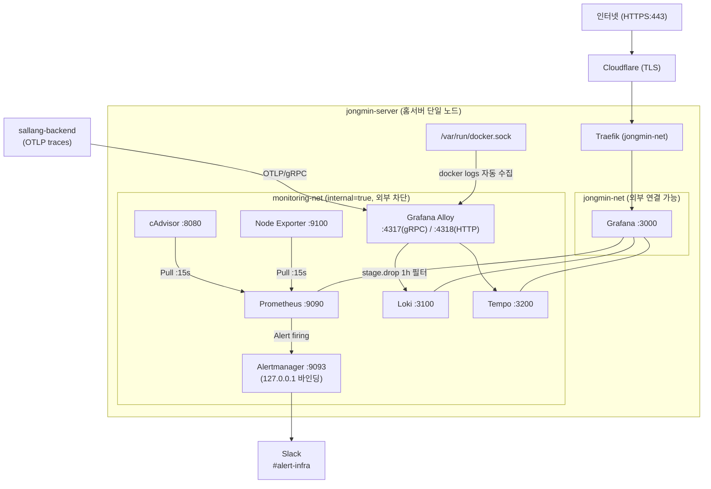
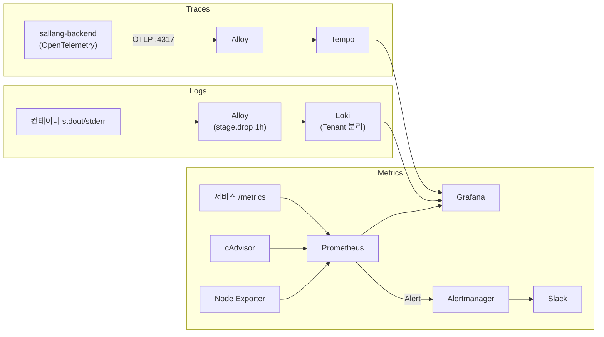

# 모니터링 스택 가이드

홈랩 서버에 구축된 **LGTM Stack** 기반 모니터링 시스템 안내입니다.

> 상세 아키텍처와 현재 정책값은
> [observability/monitoring-architecture-and-policy.md](./observability/monitoring-architecture-and-policy.md)를
> 기준으로 확인하세요. 이 문서는 운영 절차 중심의 요약 가이드입니다.

---

## 목차

1. [개요](#1-개요)
2. [현재 아키텍처](#2-현재-아키텍처)
3. [컴포넌트 설명](#3-컴포넌트-설명)
4. [데이터 흐름](#4-데이터-흐름)
5. [접근 방법](#5-접근-방법)
6. [알림 설정](#6-알림-설정)
7. [대시보드](#7-대시보드)
8. [Ansible 배포](#8-ansible-배포)
9. [운영 팁](#9-운영-팁)

---

## 1. 개요

Observability 세 축을 단일 Grafana 인터페이스로 제공합니다.

| 신호        | 도구       | 질문                           |
| ----------- | ---------- | ------------------------------ |
| **Metrics** | Prometheus | 지금 시스템이 얼마나 건강한가? |
| **Logs**    | Loki       | 무슨 일이 일어났는가?          |
| **Traces**  | Tempo      | 요청이 어느 경로로 처리됐는가? |

외부에는 `https://grafana.jongmine.cloud` 하나만 열려 있습니다. Prometheus, Loki, Tempo, Alertmanager는 모두 내부 네트워크에 격리되어 있습니다.

---

## 2. 현재 아키텍처



### 네트워크 분리

| 네트워크         | 외부 연결 | 비고                             |
| ---------------- | --------- | -------------------------------- |
| `jongmin-net`    | O         | Traefik 경유. Grafana만 연결됨   |
| `monitoring-net` | X         | `internal: true`. 직접 접근 불가 |

Grafana만 두 네트워크에 모두 연결되어 데이터 소스로 접근합니다.

---

## 3. 컴포넌트 설명

### Prometheus — 메트릭 수집

- **방식**: Pull. 15초 간격으로 `/metrics` 수집
- **수집 대상**: Node Exporter, cAdvisor, Grafana/Loki/Tempo 자체, Docker 라벨 등록 서비스
- **보존**: 15일
- **설정**: `roles/monitoring/templates/prometheus.yml.j2`

새 서비스 등록 방법 (Docker Compose 라벨):

```yaml
labels:
  monitoring.scrape: "true"
  monitoring.port: "8080"
  monitoring.path: "/actuator/prometheus"
  monitoring.team: "sallang"
```

### Loki — 로그 집계

- **방식**: Alloy가 Push. 로그 내용 대신 레이블만 인덱싱 (경량)
- **보존**: 31일 (`loki_retention: 744h`)
- **Multi-Tenancy**: `compose_project` 라벨 기반 자동 분리

> Loki 보존 기간은 Loki에 이미 저장된 로그의 수명입니다. Alloy의
> `older_than` 필터는 저장 전에 늦게 들어온 로그를 버리는 ingest 정책입니다.

| Tenant ID         | 포함 서비스                              |
| ----------------- | ---------------------------------------- |
| `infra`           | traefik, homepage, portainer, glances 등 |
| `sallang-backend` | sallang-backend-dev, sallang-redis-dev   |

### Tempo — 분산 트레이싱

- **방식**: sallang 앱 → Alloy (OTLP) → Tempo
- **보존**: 7일
- **엔드포인트**: `alloy:4317` (gRPC), `alloy:4318` (HTTP)

### Grafana — 통합 대시보드

- **URL**: `https://grafana.jongmine.cloud`
- **데이터소스**: Prometheus, Loki (infra), Loki Sallang, Tempo

### Alertmanager — 알림 라우팅

- **발송**: Slack `#alert-infra`
- **포트**: `127.0.0.1:9093` (Tailscale 경유만 접근 가능)
- **설정**: `roles/monitoring/templates/alertmanager.yml.j2`

| 설정              | 값  | 의미                           |
| ----------------- | --- | ------------------------------ |
| `group_wait`      | 30s | 첫 알림 발송 전 묶음 대기 시간 |
| `group_interval`  | 5m  | 같은 그룹 재전송 최소 간격     |
| `repeat_interval` | 12h | 지속 firing 시 리마인드 주기   |

### Grafana Alloy — 통합 에이전트

Docker 소켓 감시 → 로그 수집 → Loki Push, OTLP 수신 → Tempo 라우팅을 하나의 에이전트에서 처리합니다.

**주요 파이프라인 설정** (`roles/monitoring/templates/alloy.river.j2`):

```river
stage.drop {
  older_than          = "1h"   // late/backfill 로그 ingest 방어
  drop_counter_reason = "too_old"
}
```

> positions 파일 손실 시 오래된 로그 재전송 → Loki 거부 → CPU 과부하 무한루프를 방어합니다.
> 이 값은 Loki retention이 아니며, 현재 사후 분석성을 약화시키는 주요 검토 대상입니다.

---

## 4. 데이터 흐름



---

## 5. 접근 방법

### 외부 접근

| 서비스  | URL                              |
| ------- | -------------------------------- |
| Grafana | `https://grafana.jongmine.cloud` |

### Tailscale VPN 내부 접근

Tailscale 연결 후 직접 접근 가능합니다.

| 서비스       | 주소                         | 주요 용도                    |
| ------------ | ---------------------------- | ---------------------------- |
| Prometheus   | `http://jongmin-server:9090` | 쿼리 디버깅, 타겟 상태 확인  |
| Alertmanager | `http://jongmin-server:9093` | Silence 설정, 알림 상태 확인 |
| Loki         | `http://jongmin-server:3100` | 관리 API                     |

> Tailscale 설정은 [TAILSCALE_ACL_GUIDE.md](./TAILSCALE_ACL_GUIDE.md)를 참조하세요.

---

## 6. 알림 설정

### 인프라 알림 (`alert_rules_infra.yml.j2`)

| 알림                     | 조건                                    | 지속 |
| ------------------------ | --------------------------------------- | ---- |
| HighCPUUsage             | CPU > 80%                               | 5m   |
| HighMemoryUsage          | 메모리 > 85%                            | 5m   |
| DiskSpaceWarning         | 디스크 > 80%                            | 5m   |
| DiskSpaceCritical        | 디스크 > 90%                            | 2m   |
| NodeDown                 | Node Exporter 다운                      | 1m   |
| ContainerDown            | 컨테이너 응답 없음                      | 1m   |
| HighContainerMemoryUsage | `working_set_bytes` > 메모리 한도의 90% | 5m   |

> `container_memory_working_set_bytes` 사용 — `docker stats`와 동일 기준. 페이지 캐시 제외로 오탐 없음.

### sallang 알림 (`alert_rules_sallang.yml.j2`)

| 알림                        | 조건                                    | 지속 |
| --------------------------- | --------------------------------------- | ---- |
| SallangContainerDown        | 컨테이너 다운                           | 1m   |
| SallangHighErrorRate        | dev backend를 제외한 5xx 에러율 > 1%    | 3m   |
| SallangHighLatency          | P99 레이턴시 > 2초                      | 5m   |
| SallangMatchingQueueTooLong | 대기열 길이 > 1000                      | 5m   |
| SallangHighMemoryUsage      | `working_set_bytes` > 메모리 한도의 85% | 5m   |

### 점검 중 알림 임시 중단

Alertmanager UI(`http://jongmin-server:9093`) → Silences → New Silence

---

## 7. 대시보드

### Infrastructure 폴더 (Admin 전용)

| 대시보드                | 파일                         | 내용                              |
| ----------------------- | ---------------------------- | --------------------------------- |
| Node Exporter Full      | `node-exporter-full.json`    | 호스트 CPU/메모리/디스크/네트워크 |
| Docker Container & Host | `docker-container-host.json` | 컨테이너별 리소스 + 호스트 개요   |
| Loki Dashboard          | `loki-dashboard.json`        | 로그 볼륨, 수집 상태              |
| Traefik v3              | `traefik-v3.json`            | HTTP 요청, 에러율, 레이턴시       |

### Sallang 폴더

| 대시보드    | 파일                         | 내용                     |
| ----------- | ---------------------------- | ------------------------ |
| Sallang APM | `sallang/apm-dashboard.json` | 오류율, 레이턴시, 처리량 |

파일 위치: `roles/monitoring/files/dashboards/`

---

## 8. Ansible 배포

```bash
# Dry-run
ansible-playbook playbooks/site.yml --check --diff --tags monitoring

# 실제 배포
ansible-playbook playbooks/site.yml --tags monitoring

# 컴포넌트별
ansible-playbook playbooks/site.yml --tags monitoring-prometheus   # Prometheus + Alertmanager
ansible-playbook playbooks/site.yml --tags monitoring-alloy        # Alloy
ansible-playbook playbooks/site.yml --tags monitoring-grafana      # Grafana
ansible-playbook playbooks/site.yml --tags monitoring-grafana-dashboards  # 대시보드만
```

### Vault 편집

민감한 정보(Slack Webhook, Grafana 비밀번호 등)는 Vault에서 관리합니다.

```bash
ansible-vault edit inventory/group_vars/all/vault
```

---

## 9. 운영 팁

### 새 서비스 연동

- **메트릭**: Docker Compose에 `monitoring.scrape: "true"` 라벨 추가
- **로그**: 별도 설정 없음. Alloy가 자동 수집
- **트레이스**: OpenTelemetry SDK → `alloy:4317` (gRPC) 또는 `alloy:4318` (HTTP)

### 자주 발생하는 문제

**Grafana 로그가 안 보임**
Loki 데이터소스의 `X-Scope-OrgID` 헤더 확인. sallang 팀 → `sallang-backend`, 인프라 → `infra`

**알림이 안 옴**

1. `http://jongmin-server:9090/alerts` 에서 Alert 상태 확인
2. Alertmanager에서 Silence 여부 확인
3. Vault의 `vault_alertmanager_slack_webhook` 값 확인

**Alloy CPU가 높음**
`docker logs --since 10m loki 2>&1 | grep -c "timestamp too old"` 로 에러 확인.
`stage.drop older_than=1h` 설정이 방어하고 있으며, positions 파일 손실 직후에는 일시적으로 높을 수 있습니다.

---

## 관련 문서

- [MIGRATION_STRATEGY.md](./MIGRATION_STRATEGY.md) — Oracle Cloud 이관 및 3-Node 아키텍처 전략
- [observability/monitoring-architecture-and-policy.md](./observability/monitoring-architecture-and-policy.md) — 현재 모니터링 아키텍처와 정책값
- [observability/backend-telemetry-contract.md](./observability/backend-telemetry-contract.md) — 장애 조사형 APM을 위한 backend 필수 telemetry field
- [TROUBLESHOOTING.md](./TROUBLESHOOTING.md) — 일반적인 문제 해결
- [TAILSCALE_ACL_GUIDE.md](./TAILSCALE_ACL_GUIDE.md) — Tailscale VPN 설정
- [TRAEFIK_GUIDE.md](./TRAEFIK_GUIDE.md) — Traefik 라우팅 설정
