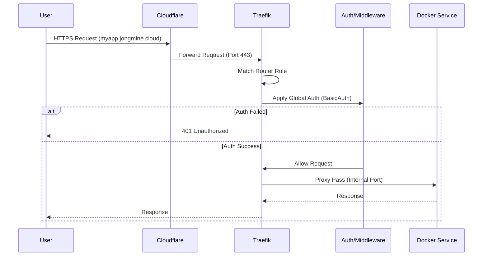

# 🚦 Traefik Gateway Guide

Traefik은 이 홈서버의 **중앙 게이트웨이(Central Gateway)** 역할을 수행하는 리버스 프록시입니다.

## 🏗️ Architecture & Network Strategy

이 서버는 보안 강화를 위해 **Proxy Tier (계층형 프록시)** 네트워크 전략을 사용합니다.

### Request Flow Diagram



### 1. Gateway Network (`jongmin-net`)

- **성격**: 외부 트래픽이 유입되어 각 서비스의 '문 앞'까지 도달하는 공용 도로입니다.
- **구성원**:
  - `traefik` (Gateway)
  - 각 서비스의 **Web Server / Proxy Container** (Frontend)
- **접근 제어**: 이 네트워크는 외부로 노출될 가능성이 있으므로, **Database나 내부 API 컨테이너는 절대 연결하지 않습니다.**

### 2. Internal Networks (Service Isolated)

- **성격**: 각 서비스 내부의 컴포넌트끼리만 통신하는 격리된 사설망입니다.
- **구성원**:
  - Web Server (Frontend)
  - Database, Redis, Worker (Backend)
- **특징**: Traefik은 이 네트워크에 접근할 수 없습니다. 오직 Web Server를 통해서만 트래픽이 전달됩니다.

---

## 🔐 Security Features

### 1. Global Basic Auth

- **정책**: `websecure` (HTTPS/443) 포트로 들어오는 **모든 요청**에 대해 기본적으로 Basic Auth(`auth-jongmin`)가 강제됩니다.
- **예외 처리**: 공개가 필요한 서비스(예: 블로그, 랜딩 페이지)가 있다면 해당 서비스의 router label에서 미들웨어를 재정의하거나 `web` 엔트리포인트 전략을 수정해야 합니다. (현재는 기본 강제)

### 2. Automatic HTTPS

- Cloudflare DNS Challenge를 통해 Wildcard 인증서(`*.jongmine.cloud`)를 자동 발급/갱신합니다.

---

## 🌐 DNS Configuration (Cloudflare)

Traefik이 특정 서비스를 라우팅하기 위해서는 해당 도메인이 우리 서버를 가리켜야 합니다.

- **권장 방식 (Wildcard)**:
  - Cloudflare DNS 설정에서 `*` (Type A) 레코드를 생성하고 서버의 **공인 IP**를 연결하세요.
  - 이렇게 하면 `any-name.jongmine.cloud`로 들어오는 모든 요청이 우리 서버로 도달하며, 이후에는 Traefik이 Label을 보고 적절한 컨테이너로 넘겨줍니다.
- **개별 등록 방식**:
  - 보안상 와일드카드를 쓰지 않는다면, 새로운 서비스를 추가할 때마다 Cloudflare에서 해당 도메인(예: `myapp.jongmine.cloud`)을 직접 등록해줘야 합니다.

---

## ⚙️ Configuration File Structure

Traefik 설정은 두 곳으로 나뉩니다:

1.  **Static Config (`roles/traefik/tasks/main.yml`)**:

    - EntryPoints (:80, :443)
    - Providers (Docker, File)
    - Certificate Resolvers (Cloudflare)
    - **변경 시**: Traefik 컨테이너 재시작 필요.

2.  **Dynamic Config (`roles/traefik/templates/config.yml.j2`)**:
    - Middlewares (Auth, Headers)
    - TLS Options
    - Custom Routers/Services (Non-Docker services)
    - **변경 시**: 파일 저장 시 즉시 반영 (Hot Reload).

---

## 📝 Service Label Reference

새로운 서비스를 Traefik에 연결할 때 사용하는 표준 라벨입니다.

```yaml
labels:
  # 1. 활성화
  - "traefik.enable=true"

  # 2. 라우터 설정
  - "traefik.http.routers.my-app.rule=Host(`my-app.jongmine.cloud`)"
  - "traefik.http.routers.my-app.entrypoints=websecure"
  - "traefik.http.routers.my-app.tls.certresolver=cloudflare"

  # 3. 서비스 포트 (컨테이너 내부 포트)
  - "traefik.http.services.my-app.loadbalancer.server.port=80"

  # 4. (옵션) 미들웨어 추가/변경
  # 기본적으로 전역 Auth가 적용되지만, 추가 헤더가 필요하다면:
  # - "traefik.http.routers.my-app.middlewares=auth-jongmin@file,custom-headers@file"
```
