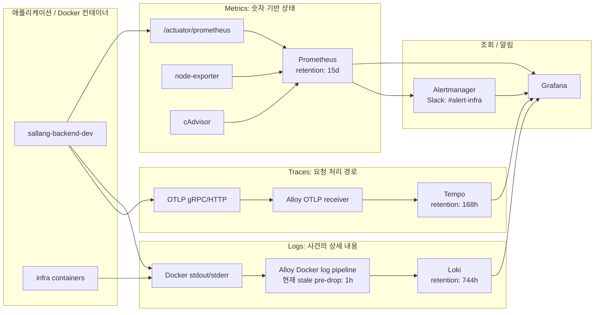
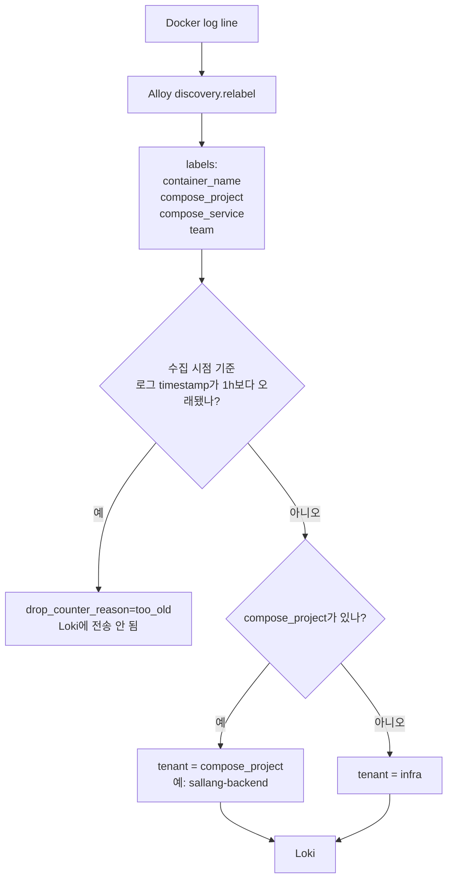
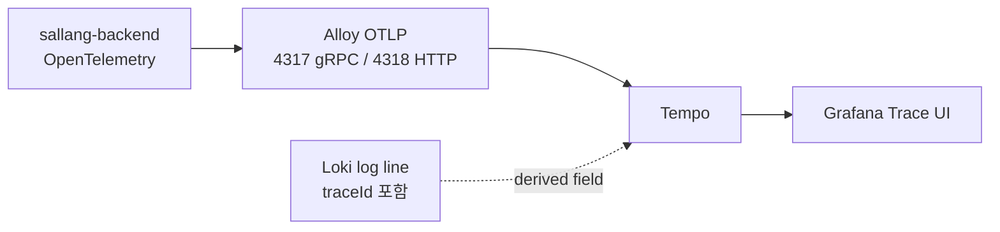
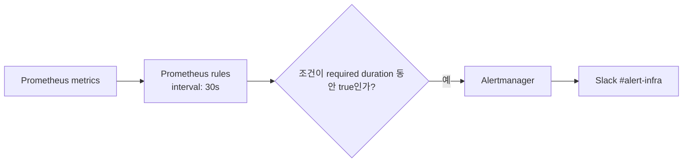

# 모니터링 아키텍처와 현재 정책

최종 확인일: 2026-05-12

이 문서는 현재 `jongmin-server`의 모니터링 스택이 메트릭, 로그, 트레이스, 알림을 어떻게 처리하는지 설명합니다. 특히 이번 이슈에서 헷갈렸던 **Loki 보존 기간**과 **Alloy 수집 전 drop 정책**을 분리해서 기록합니다.

## 어떤 문서를 봐야 하나

| 목적                         | 문서                                                                           |
| ---------------------------- | ------------------------------------------------------------------------------ |
| 현재 모니터링 구조/정책 이해 | 이 문서                                                                        |
| 실제 Ansible 구현 계획       | `docs/superpowers/plans/2026-05-12-apm-observability-hardening-ansible.md`     |
| 초기 초안                    | `docs/superpowers/plans/2026-05-12-observability-policy-hardening.md` - 대체됨 |

## 설정 원본

| 영역                           | 파일                                                                                                           |
| ------------------------------ | -------------------------------------------------------------------------------------------------------------- |
| Prometheus scrape / rule 로딩  | `roles/monitoring/templates/prometheus.yml.j2`                                                                 |
| Prometheus alert rule          | `roles/monitoring/templates/alert_rules_infra.yml.j2`, `roles/monitoring/templates/alert_rules_sallang.yml.j2` |
| Alertmanager 라우팅            | `roles/monitoring/templates/alertmanager.yml.j2`                                                               |
| Loki retention / limits        | `roles/monitoring/templates/loki.yml.j2`, `roles/monitoring/defaults/main.yml`                                 |
| Alloy 로그/트레이스 파이프라인 | `roles/monitoring/templates/alloy.river.j2`                                                                    |
| Grafana datasource             | `roles/monitoring/templates/datasources.yml.j2`                                                                |
| Tempo retention                | `roles/monitoring/templates/tempo.yml.j2`, `roles/monitoring/defaults/main.yml`                                |
| Docker log rotation            | 현재 repo에서 설정하지 않음. 실제 컨테이너는 Docker `json-file` + 빈 log option 상태                           |

## 실제 서버 팩트체크

2026-05-12 KST에 `jongmin-server`에 `jongmin-infra` 계정으로 SSH 접속해 확인했습니다.

| 항목                       | 실제 서버 상태                                                                                                                | 판정                |
| -------------------------- | ----------------------------------------------------------------------------------------------------------------------------- | ------------------- |
| 모니터링 컨테이너          | `prometheus`, `loki`, `tempo`, `grafana`, `alloy`, `alertmanager`, `node-exporter`, `cadvisor` 실행 중                        | 확인됨              |
| Alloy stale pre-drop       | `/etc/monitoring/alloy/config.alloy`에 `older_than = "1h"`                                                                    | 확인됨              |
| Alloy live 주석            | 값은 `1h`인데 주변 주석은 아직 `168h`라고 되어 있음                                                                           | 문서/주석 드리프트  |
| Loki retention             | `/etc/monitoring/loki/config.yml`에 `retention_period: 744h`, compactor retention enabled                                     | 확인됨              |
| Tempo retention            | `/etc/monitoring/tempo/config.yml`에 `block_retention: 168h`                                                                  | 확인됨              |
| Prometheus retention       | `--storage.tsdb.retention.time=15d`                                                                                           | 확인됨              |
| Sallang metric label       | `sallang-backend-dev`가 `team="sallang"`, `compose_project="sallang-backend"`, `application="sallang-backend-dev"`로 scrape됨 | 확인됨              |
| Loki tenant label          | tenant `sallang-backend`에 `sallang-backend-dev`, `sallang-postgres-dev`, `sallang-redis-dev` 존재                            | 확인됨              |
| `logback_events_total`     | Prometheus에 `application="sallang-backend-dev"` 기준으로 존재                                                                | 확인됨              |
| Alloy drop metric          | Alloy `/metrics`에 `loki_process_dropped_lines_total{reason="too_old"}` 존재                                                  | 확인됨              |
| Prometheus의 Alloy scrape  | live Prometheus config에 `alloy` job 없음                                                                                     | 미구현              |
| Docker log rotation        | live container들이 `json-file` + empty `LogConfig.Config` 사용. `max-size`, `max-file` 없음                                   | 미구현              |
| Grafana Loki derived field | `Loki`, `Loki (Sallang)` 모두 `"traceId":"(\w+)"` regex로 Tempo link 설정                                                     | 확인됨, 포맷 의존적 |

## 전체 구조



## 각 신호가 답하는 질문

| 신호    | 질문                            | 도구                           |
| ------- | ------------------------------- | ------------------------------ |
| Metrics | 지금 시스템이 건강한가?         | Prometheus, Grafana            |
| Logs    | 정확히 무슨 일이 있었나?        | Alloy, Loki, Grafana Explore   |
| Traces  | 한 요청이 어느 경로로 처리됐나? | Alloy, Tempo, Grafana          |
| Alerts  | 누가 언제 알아야 하나?          | Prometheus rules, Alertmanager |

## 현재 정책값

| 정책                           | 현재 값                                 | 의미                                                                         |
| ------------------------------ | --------------------------------------- | ---------------------------------------------------------------------------- |
| Prometheus scrape interval     | `15s`                                   | 15초마다 metric 수집                                                         |
| Prometheus evaluation interval | `15s`                                   | 15초마다 alert rule 평가                                                     |
| Prometheus retention           | `15d`                                   | metric 15일 보관                                                             |
| Loki retention                 | `744h`                                  | Loki에 이미 저장된 로그를 약 31일 보관                                       |
| Alloy stale log pre-drop       | `older_than = "1h"`                     | 수집 시점 기준 event timestamp가 1시간보다 오래된 로그를 Loki 전송 전에 drop |
| Tempo retention                | `168h`                                  | trace 7일 보관                                                               |
| Grafana Loki `maxLines`        | `1000`                                  | Grafana가 Loki에서 기본 최대 1000 log row 요청                               |
| Docker log driver              | `json-file`, `max-size`/`max-file` 없음 | live 컨테이너 Docker JSON 로그 파일 크기 제한 없음                           |
| Alloy metrics scrape           | Prometheus가 scrape하지 않음            | Alloy에는 metric이 있지만 Prometheus에서 장기 관측 불가                      |
| Alert grouping                 | `group_by: alertname, team`             | alertname/team 기준 묶음 발송                                                |
| First alert wait               | `30s`                                   | 첫 알림 전 30초 대기                                                         |
| Repeat interval                | `12h`                                   | firing 지속 시 12시간마다 재알림                                             |

## 가장 중요한 구분

```text
Loki retention:
  Loki에 이미 들어간 로그를 얼마나 오래 보관할지

Alloy older_than:
  Loki에 넣기 전에 오래된 timestamp 로그를 버릴지
```

`older_than = "1h"`는 Loki에 저장된 로그를 1시간 후 삭제하는 설정이 아닙니다. Alloy가 Docker 로그를 늦게 읽거나 backfill하는 상황에서 event timestamp가 1시간보다 오래된 로그를 Loki에 넣기 전에 버리는 설정입니다.

이 설정은 Loki를 보호하는 안전장치이지만, 사후 분석성은 약화시킵니다.

## 로그 흐름과 tenant mapping



백엔드 조사 시 자주 쓰는 LogQL:

```logql
{container_name="sallang-backend-dev"} |= "ERROR"
```

```logql
{container_name="sallang-backend-dev"} |= "traceId" |= "<trace-id>"
```

```logql
{application="sallang-backend-dev"} |= "POST /api/v1/blocks"
```

백엔드 로그는 Grafana의 `Loki (Sallang)` datasource를 사용해야 합니다. 이 datasource는 `X-Scope-OrgID: sallang-backend`를 보냅니다. 인프라 로그는 기본 `Loki` datasource를 사용하며 `X-Scope-OrgID: infra`를 보냅니다.

## Trace와 Log 연결



현재 Grafana derived field는 아래 형태의 로그를 기대합니다.

```text
"traceId":"<trace-id>"
```

아래처럼 포맷이 달라지면 Tempo jump가 안 보일 수 있습니다.

```text
"traceId": "..."
trace_id=...
traceId=...
```

따라서 backend 로그 포맷을 고정하거나 derived field regex를 넓혀야 합니다.

## 알림 정책



현재 infra alert:

| Alert                      | 조건                                     | 지속 |
| -------------------------- | ---------------------------------------- | ---- |
| `HighCPUUsage`             | host CPU > 80%                           | 5m   |
| `HighMemoryUsage`          | host memory > 85%                        | 5m   |
| `DiskSpaceWarning`         | filesystem usage > 80%                   | 5m   |
| `DiskSpaceCritical`        | filesystem usage > 90%                   | 2m   |
| `NodeDown`                 | node exporter down                       | 1m   |
| `ContainerDown`            | container not seen > 60s                 | 1m   |
| `HighContainerMemoryUsage` | container working set > memory limit 90% | 5m   |

현재 Sallang alert:

| Alert                         | 조건                           | 지속 |
| ----------------------------- | ------------------------------ | ---- |
| `SallangContainerDown`        | Sallang container absent       | 1m   |
| `SallangHighErrorRate`        | 5xx ratio > 1%                 | 3m   |
| `SallangHighLatency`          | P99 latency > 2s               | 5m   |
| `SallangMatchingQueueTooLong` | queue length > 1000            | 5m   |
| `SallangHighMemoryUsage`      | Sallang container memory > 85% | 5m   |

현재 gap:

- `SallangHighErrorRate`는 비율 기반이고 3분 지속 조건이 있습니다.
- dev/QA처럼 트래픽이 적은 환경에서는 짧은 500 몇 건을 놓칠 수 있습니다.
- dev에는 absolute count alert가 필요합니다.

예:

```promql
increase(http_server_requests_seconds_count{status=~"5..", application="sallang-backend-dev"}[5m]) > 0
```

## 현재 주요 리스크

| 리스크                   | 이유                                                                    |
| ------------------------ | ----------------------------------------------------------------------- |
| 문서/주석 드리프트       | 과거 문서/주석에는 `stage.drop 168h`가 남아 있었고 실제 값은 `1h`       |
| 사후 로그 분석 약화      | `older_than=1h`는 cursor drift/backfill 상황에서 1시간 초과 로그를 버림 |
| dev 5xx 감지 약함        | 비율 기반 alert는 낮은 트래픽의 짧은 장애를 놓칠 수 있음                |
| tenant/label 탐색 어려움 | datasource/tenant/label을 모르면 Loki 검색이 오래 걸림                  |
| trace link 취약          | `traceId` 포맷에 따라 Tempo jump가 깨질 수 있음                         |
| Alloy metric blind spot  | `too_old` drop counter는 있지만 Prometheus가 scrape하지 않음            |
| Docker 로그 파일 무제한  | log rotation이 없어 cursor drift 시 replay 크기가 커질 수 있음          |
| PII 정책 미정            | UUID/email/phone 등 민감 정보 처리 정책이 없음                          |

## 보완 방향

1. 정책을 분리해서 관리합니다.
   - Loki retention
   - Alloy stale-log pre-drop
   - Docker JSON log rotation
   - Tempo retention
2. `alloy_log_drop_older_than`을 Ansible 변수로 뺍니다.
3. Prometheus가 Alloy를 scrape하게 만들어 `loki_process_dropped_lines_total{reason="too_old"}`를 관측합니다.
4. Docker `json-file` rotation을 먼저 설정합니다.
5. 그 다음 dev의 `older_than`을 `1h`에서 `24h`로 완화할지 결정합니다.
6. dev 5xx / ERROR absolute alert를 추가합니다.
7. APM dashboard를 장애 조사 cockpit으로 정리합니다.
8. backend telemetry contract를 문서화합니다.
9. Tempo metrics-generator / service graph는 별도 후속 계획으로 진행합니다.

Open decision: Docker log rotation과 Alloy drop-rate monitoring을 배포하고 관측한 뒤 dev를 `1h`에서 `24h`로 완화할지 결정합니다.

Backend 계측 요구사항은 `docs/observability/backend-telemetry-contract.md`에 정리할 예정입니다.

## 후속 보류: Tempo metrics-generator

현재 Tempo는 trace를 저장하지만 span metrics나 service graph를 생성하지 않습니다.

Tempo metrics-generator는 Tempo에 들어온 trace/span을 집계해 Prometheus가 볼 수 있는 metric과 service graph를 만드는 기능입니다.

현재 상태:

- trace 원본은 Tempo에 저장됩니다.
- traceId를 알면 Grafana에서 개별 trace를 열 수 있습니다.
- 하지만 trace 기반 service graph, span latency metric, error span metric, exemplar 연결은 충분하지 않습니다.

metrics-generator를 켜면 기대할 수 있는 것:

- `metric spike -> exemplar trace` 이동
- service 간 호출 관계 그래프
- span latency / error count metric
- endpoint나 downstream dependency 기준의 병목 파악

바로 켜지 않는 이유:

- backend의 `service.name`, `deployment.environment`, `service.version`이 먼저 안정화되어야 합니다.
- DB/Redis/external HTTP/exception span이 충분히 나와야 service graph가 의미 있습니다.
- span 이름이나 attribute가 불안정하면 Prometheus metric cardinality가 증가할 수 있습니다.
- 현재 우선순위는 로그 손실 관측, Docker replay 방어, Grafana query 안정화입니다.

목표 기능:

- metric spike에서 exemplar trace로 이동
- service graph
- span latency / error metrics

선행 조건:

- `service.name`, `service.version`, `deployment.environment` 표준화
- DB, Redis, 외부 HTTP, exception event span 계측
- 새 metric cardinality 검토

따라서 이 작업은 첫 번째 안전화 작업이 끝난 뒤 별도 계획으로 진행합니다.
